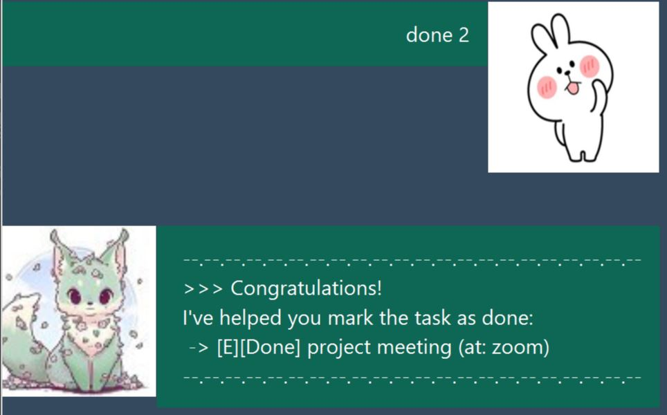

# Duke: The AI Butler in Training's User Guide
## Description
Duke is a butler bot that aims to help you manage your tasks. 
For now, you can add, edit, delete and search for specific tasks.

## Features of the application
### 1. Add Tasks
There are three types of tasks you can add to Duke's task list.

Add a <b>todo</b> task to Duke's task list.  
Command: `todo {DESCRIPTION}`

Example: `todo revise homework`

Add an <b>event</b> task to Duke's task list.  
Command: `event {DESCRIPTION} /at {DETAILS}`

Example: `event project meeting /at zoom`

Add a <b>deadline</b> task to Duke's task list.  
Note: {DUEDATE} needs to be a date in 'YYYY-MM-DD' format.

Command: `deadline {DESCRIPTION} /by {DUEDATE}`

Example: `deadline do homework /by 2020-12-18`

### 2. Delete Tasks
Delete the tasks identified by the index number shown in Duke's task list.  
Command: `delete {INDEX}`

Example: `delete 4`

### 3. List all Tasks
List all the tasks in Duke's task list.  
Command: `list`

Example: `list`

### 4. Complete Tasks
Mark a task done in Duke's task list.  
Command: `done {INDEX}`

Example: `done 2`

### 5. Search for specific tasks with a keyword
Duke will list out tasks in his task list containing the given keyword, if there are any.

Note: {KEYWORD} is case-sensitive.

Command: `find {KEYWORD}`

Example: `find homework`

### 6. Update description of Tasks
Update the description of a task in Duke's task list.
- Duke will first ask you for the index of the task you wish to update.

    Command: `update {INDEX}`

- You will have to follow-up after his response with an input of the new task description for Duke to update the task with.

    Command: `{DESCRIPTION}`

Example:

`update 1`

`study for exams`

### 7. Storage feature
Duke will automatically save his task list when you close out of the application.

Alternatively, you can use his command to save his data and close the application manually.

Command: `bye`

The summary of Duke's task list will be saved in the directory ./data/tasks.txt.

## Credits
Base code from 
- https://github.com/nus-cs2103-AY2021S1/ip

Duke's image by naomi_lord
- https://www.instagram.com/p/BlTepF1AC5l/?igshid=tcgad3f4nh26

User's image from telegram stickers
- https://t.me/addstickers/SpoiledRabbit_Apricot