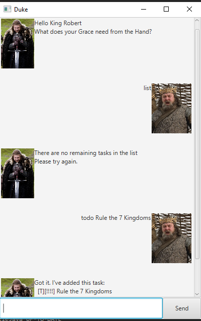

# User Guide

## Introduction
Duke is a chatbot to keep all your ToDos, Events and Deadlines at your fingertips. It comes with a Graphical user interface (GUI) and is optimized for Command-line interface (CLI) users.

## Quick start
1. Install Java 11 or later on your computer.
1. Download the latest JAR file for Duke (`duke.jar`) from the [releases page](https://github.com/jeffreytjs/ip/releases).
1. To start Duke as a graphical program, either double-click on the JAR file, or by run `java -jar duke.jar` in the terminal. 
To start Duke as a command line program instead, run `java -jar duke.jar cli` in the terminal.
1. Type a command into the input box and press <kbd>Enter</kbd> to start using Duke!

## Features 
* [View guide](#viewing-the-guide---help-or-)
* [Add ToDo](#adding-a-todo---todo)
* [Add Deadline](#adding-a-deadline---deadline)
* [Add Event](#adding-an-event---event)
* [Delete task](#deleting-an-item---delete)
* [List all tasks](#displaying-all-tasks-in-list---list)
* [Mark task as done](#mark-task-as-done---done)
* [Find tasks by keyword](#finding-an-item---find)
* [Exit Duke](#exiting-duke---bye)
* [Appendix](#appendix)

## Format of this guide
- Words in UPPER_CASE are the parameters to be supplied by the user.
  e.g. in `todo DESCRIPTION`, `DESCRIPTION` is a parameter which can be used as `todo read book`.
- Items in square brackets are optional.
  e.g in `event DESCRIPTION /at DATE [TIME]`, `TIME` is optional and the brackets are not to be included.

### Viewing the guide - `help` or `?`
Format: `help` or `?`

Displays a message to guide user input for each command.

### Adding a todo - `todo`
Format: `todo DESCRIPTION`

Adds a new ToDo task to the list.

Example of usage:

`todo buy apple`

Expected outcome:

`Got it. I've added this task:`  
`[T][✘] buy apple`  
`Now you have 1 task(s) in your list.`

### Adding a deadline - `deadline`
Format: `deadline DESCRIPTION /by DATE [TIME]`

Adds a new Deadline task to the list with the specific description and due date with time being optional.

Acceptable date and time formats can be found in the appendix.

Example of usage:

`deadline math quiz /by 2020-10-12 1800`

Expected outcome:

`Got it. I've added this task:`  
`[D][✘] math quiz (by: 2020-10-12 1800)`  
`Now you have 2 task(s) in your list.`

### Adding an event - `event`
Adds an event with a start and end time to the list.

Format: `event DESCRIPTION /at DATE [TIME]`

Adds a new Event task to the list with the specific description and due date with time being optional.

Acceptable date and time formats can be found in the appendix.

Example of usage:

`event countdown party /at 2020/12/31`

Expected outcome:

`Got it. I've added this task:`  
`[E][✘] countdown party (at: 2020/12/31)`  
`Now you have 3 task(s) in your list.`

### Deleting an item - `delete`
Format: `delete TASK_INDEX`

Deletes the task at the specified `TASK_INDEX` of the task list.

Example of usage:

`delete 3`

Expected outcome:

`Poof. I've removed this task:`  
`[E][✘] countdown party (at: 2020/12/31)`
`Now you have 2 task(s) in the list.`

### Displaying all tasks in list - `list`
Format: `list`

Displays all current tasks in the list.

Example of usage:

`list`

Expected outcome:

`Let's see what we have here:`

`1. [T][✘] buy apple`  
`2. [D][✘] math quiz (by: 2020-10-12 1800)`  

### Mark task as done - `done`
Format: `done TASK_INDEX`

Marks the task at the specified `TASK_INDEX` of the task list as done.

Example of usage:

`done 1`

Expected outcome:

`Nice! I've marked this task as done:`  
`[T][✓] buy apple`

### Finding an item - `find`
Format: `find KEYWORD`

Finds and displays tasks containing the given `KEYWORD`.

Example of usage:

`find apple`

Expected outcome:

`Here are the tasks that matched with "apple" in your list:`  
`1. [T][✘] buy apple` 

### Exiting Duke - `bye`
Format: `bye`

Exits the application.

### Saving the data
Duke data are saved in the hard disk automatically after any command that changes the data. There is no need to save manually.

### Appendix
### Date and time formats
Acceptable Date and Time format are as follows:
Note: The dashes ( - ) can be replaced with slashes ( / ).

#### Date:
| Format | Example |
| ------- | -------- |
| YYYY-MM-DD | 2020-10-21 |

#### Date:
| Format | Example |
| ------ | ------- |
| HHmm | 1800 |
