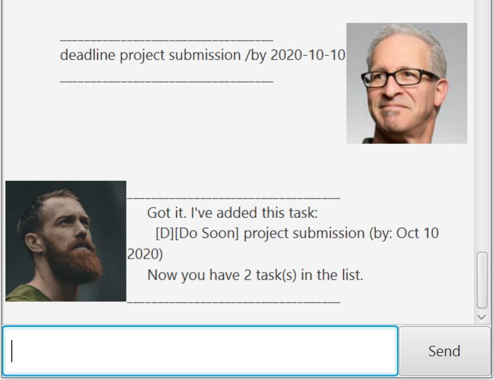

# User Guide

## Content Page
1. [Introduction](#introduction)
2. [Getting Started](#getting-started)
3. [Features](#features)
4. [FAQ](#faq)
5. [Command Summary](#command-summary)
5. [Acknowledgements](#acknowledgements)

## Introduction
RJ21 is a one-stop task manager desktop app that 
helps you to keep track of your to-dos, deadlines 
and events.

### Getting Started
1. Ensure that you have at least **Java 11** installed in your laptop.
2. Download the latest version of RJ21.jar file here.
3. Once downloaded, double-click it to run.
4. You should see something like this:
 

5. Type the command in the command box and press Enter to execute it.

### Features
1. [Add tasks](#feature-1-add-tasks)
2. [List all tasks](#feature-2-list-all-tasks)
3. [Mark tasks as done](#feature-3-mark-tasks-as-done)
4. [Delete tasks](#feature-4-delete-tasks)
5. [Find tasks using keyword](#feature-5-find-tasks-using-keyword)
6. [Update current tasks](#feature-6-update-tasks)
7. [Get list of commands](#feature-7-get-list-of-commands)
8. [Exit RJ21](#feature-8-quit-rj21)

#### Feature 1: Add tasks
You can add tasks of 3 types: To-do, Deadline and Event.

#### Usage:
1. To-do: `todo <description>`
    * Example: `todo iP user guide`
     
     
    Expected outcome:
     
     
     
    
2. Deadline: `deadline <description> /by <YYYY-MM-DD>`
    * Example: `deadline iP user guide /by 2020-09-13`
     
     
    Expected outcome:
     
     
     
  
3. Event: `event <description /at <YYYY-MM-DD>`
    * Example: `event CS2103T lecture /at 2020-09-11`
     
     
    Expected outcome:
     
     
     
    
#### Feature 2: List all tasks
You can list out all the tasks that you had added.

#### Usage:  
Get list of tasks: `list`
     
   * Example: `list`
     
     
    Expected outcome:
     
     
     
    
#### Feature 3: Mark tasks as done
You can mark your completed tasks as done.

#### Usage:  
Mark task as done: `done <index>`
     
   * Example: `done 1`
     
     
    Expected outcome:
     
     
     

#### Feature 4: Delete tasks
You can delete your tasks.

#### Usage:  
Delete task: `delete <index>`
     
   * Example: `delete 1`
     
     
    Expected outcome:
     
     
      
    
#### Feature 5: Find tasks using keyword
You can find all matching tasks by searching the keyword.

#### Usage:  
Find task: `find <keyword>`
     
   * Example: `find user`
     
     
    Expected outcome:
     
     
      
    
#### Feature 6: Update tasks
You can update your current task's description or date.

#### Usage:  
Find task: `update <index> <desc/date> <new description/YYYY-MM-DD>`
     
   * Example: `update 1 date 2020-09-15`
     
     
    Expected outcome:
     
     
      
    
   * Example: `update 2 desc CS2103T Week6 Quiz`
     
     
    Expected outcome:
     
     
      
    
#### Feature 7: Get list of commands
You can view all available commands to use.

#### Usage:  
Get list of commands: `help`
     
   * Example: `help`
     
     
    Expected outcome:
     
     
      

#### Feature 8: Quit RJ21
You can exit and close the application.

#### Usage: 
Exit: `bye`

Expected outcome: RJ21 closed immediately.

### FAQ
**Q**: How do I transfer my data to another computer?
 
**A**: Install the app in the other computer and overwrite 
the empty data file it creates with the file that contains 
the data of your previous RJ21 home folder.

If you have any further questions, please contact me through the email provided in acknowledgements.

### Command Summary

Action | Format
------------ | -------------
Add | 1. `todo <description>`   2. `deadline <description> /by <YYYY-MM-DD>`   3. `event <description /at <YYYY-MM-DD>`
List | `list`
Done | `done <index>`
Delete | `delete <index>`
Find | `find <keyword>`
Update | `update <index> <desc/date> <new description/YYYY-MM-DD>`
Help | `help`
Bye | `bye`

### Acknowledgements
All images and characters used belonged to the respective owners. 
According to fair use, the images used is for my CS2103T individual project 
and for educational purpose solely. If there is any problems with using the
images found online, please contact me at michaeliatantong@gmail.com.
