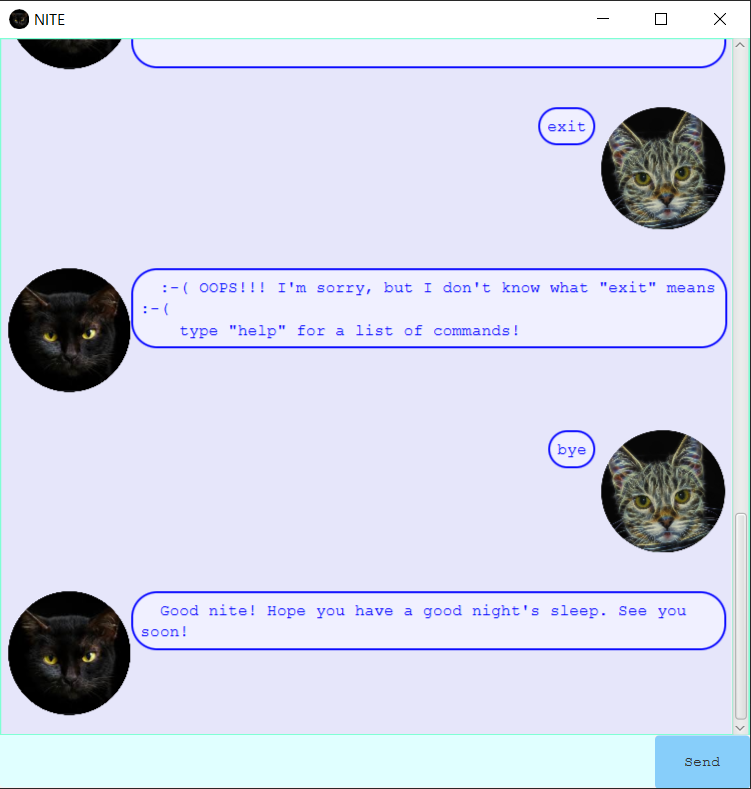

# Nite User Guide
Nite is a task tracking cat-bot, dark as the night, and convenient to use.

* [Quick Start](#quick-start)
* [Features](#features)
    1. [View Help](#view-help)
    2. [Add tasks](#add-tasks)
    3. [List tasks](#list-tasks)
    4. [Mark tasks as done](#mark-tasks-as-done)
    5. [Find tasks with keyword](#find-tasks-with-keyword)
    6. [Sort list of tasks](#sort-list-of-tasks)
    7. [Delete tasks](#delete-tasks)
    8. [Exit Nite](#exit-nite)
* [FAQ](#faq)
* [Acknowledgements](#acknowledgements)

## Quick Start
1. Ensure you have `Java 11` or above installed in your Computer.
2. Download the latest nite.jar from [here](https://github.com/cwenling/ip/releases/tag/A-Release).
3. Copy the file to the folder you want to use as the home folder for Nite.
4. Double-click the file, and Nite will wake up. Your chat with Nite will appear:

5. Type your command in the text box and press `Enter` to execute the command.
You can start chatting with Nite now!

## Features 

### View Help
Nite sends you a message listing out all the available commands.

#### Usage

##### `help` - List all commands
Lists out all available Nite commands. 

Example of usage: `help`

Expected outcome:

### Add tasks
Add 3 different types of tasks, such as Todo, Deadline, and Event.

#### Usage

##### 1. `todo DESCRIPTION` - Add a Todo task

Adds a Todo task, which is a generic non-time-sensitive task.

Example of usage: `todo feed my cat`

Expected outcome:

##### 2. `deadline DESCRIPTION /by YYYY-MM-DD HHmm` - Add a Deadline task

Adds a Deadline task, which is task to be completed by a certain time.

Example of usage: `deadline book a vet visit /by 2020-10-03 2359`

Expected outcome:

##### 3. `event DESCRIPTION /at YYYY-MM-DD HHmm to YYYY-MM-DD HHmm` - Add an Event task

Adds an Event task, which is task occuring in a certain time window.

Example of usage: `event catwalk parade /at 2020-12-25 1400 to 2020-12-25 1600`

Expected outcome:

## List tasks
You can list all your tasks stored in Nite.

#### Usage

##### `list` - List
Displays a list of all your current tasks, completed and incomplete.

Example of usage: `list`

Expected outcome:

## Mark tasks as done
Nite can mark and keep track of which tasks you have already completed.

#### Usage

##### `done TASK_NUMBER` - Mark a task as done
Marks a task as 'done'.

Example of usage: `done 2`

Expected outcome:

## Find tasks with keyword
Nite can find your tasks that match your specified keyword.

#### Usage

##### `find KEYWORD` - Find tasks
Find and list tasks that match the keyword.

Example of usage: `find cat`

Expected outcome:

## Sort list of tasks
Nite can help you to sort selected types of tasks according to time and description

#### Usage

##### `sort [TASK_TYPE] [TASK_TYPE] [TASK_TYPE]` - Sort tasks
Sorts and displays specified task types.

Example of usage: `sort deadline`
Sorts all deadline type tasks according to urgency.

Expected outcome:

Example of usage: `sort deadline todo`
Sorts all deadline type tasks according to urgency, followed by all todo type tasks according to description.

Expected outcome:

## Delete tasks
Nite can delete a task that you no longer want to track.

#### Usage

##### `delete TASK_NUMBER` - Delete a task
Deletes a task.

Example of usage: `delete 2`

Expected outcome:

## Exit Nite
Nite closes the application.

#### Usage

##### `bye` - Nite goes to sleep, and the window will close automatically.

Example of usage: `bye`

Expected outcome:

## Acknowledgements
Resources:
src/main/resources/audio/meow2.wav uses this sound from freesound:
Cat meow by wesleyextreme_gamer (https://freesound.org/people/wesleyextreme_gamer/sounds/530341/)

src/main/resources/images/blackcat_circle.png is edited from iStockPhoto:
Black cat by sarayut (https://www.istockphoto.com/photo/closeup-portrait-black-cat-the-face-in-front-of-eyes-is-yellow-halloween-black-cat-gm901574784-248725535)

src/main/resources/images/usercat_circle.png is edited from pixabay:
Cat by ArtTower (https://pixabay.com/illustrations/fractal-cat-feline-portrait-animal-681584/)

