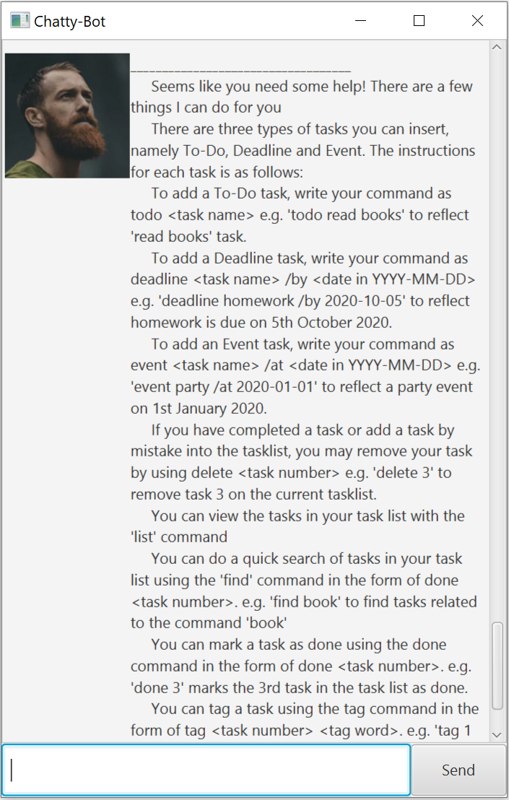

# Duke User Guide
**Duke** is a Personal Assistant ChatBot that helps you to **keep track of various tasks** such as todo, deadline 
and event in daily life. This application allows users to manage their tasks via **Command Line Interface** (CLI) 
while still having the benefits of a Graphical User Interface (GUI).

## Quick Start
1. Ensure you have Java 11 or above installed in your computer.
2. Download the latest `duke.jar` from !here[url]
3. Copy the file to the folder you want to use as _home folder_ for Duke
4. Double-click the file to start the app. The GUI similar to the below should appear in a few seconds.
 

5. Type the command in the command box and press Enter to execute it. 
   e.g. typing `help` and pressing Enter will open the help window.
6. Refer to the *Features* below for details of each command.

## Features

### Viewing help: `help` 
Shows a list of commands that can be used.
 
Format: `help`
 

### Listing all tasks: `list`
Shows a list of tasks that has been added and saved.
 
Format: `list`
 

### Adding a Todo task: `todo`
Adds a Todo task to the list of tasks.
 
Format: `todo TASK`
 
Example: todo play piano
 

### Adding a Deadline task: `deadline`
Adds a Deadline task to the list of tasks.
 
Format: `deadline TASK /by YYYY-MM-DD`
 
Example: deadline homework /by 2020-10-12
 

### Adding an Event task: `event`
Adds an Event task to the list of tasks.
 
Format: `event TASK /at YYYY-MM-DD`
 
Example: event birthday party /at 2020-12-20
 

### Deleting a task: `delete`
Deletes a task at a specific index from the list of tasks.
 
Format: `delete LIST_INDEX`
 
Example: delete 2
 

### Marking a task as done: `done`
Marks a task at a specific index in the list of tasks as done.
 
Format: `done LIST_INDEX`
 
Example: done 5
 

### Finding a task: `find`
Shows a list of tasks which contains the specific keyword in description.
 
Format: `find KEYWORD`
 
Example: find book
 

### Closing the application: `bye`
Closes the application. Every previously added task is saved.
 
Format: `bye`
 

### When Duke detects duplicates:

### Saying yes: `yes`
Adds a duplicated task to the list of tasks.
 
Format: `yes`
 

### Saying no: `no`
Does not add a duplicated task to the list of tasks.
 
Format: `no`
 

### Command summary
Action | Format, Examples
------------ | -------------
Help | `help`
List | `list`
Todo | `todo TASK`   e.g., `todo play piano`
Deadline | `deadline TASK /by YYYY-MM-DD`   e.g., `deadline homework /by 2020-10-12`
Event | `event TASK /at YYYY-MM-DD`   e.g., `event birthday party /at 2020-12-20`
Delete | `delete LIST_INDEX`   e.g., `delete 2`
Done | `done LIST_INDEX`   e.g., `done 5`
Find | `find KEYWORD`   eg, `find book`
Bye | `bye`
Yes | `yes`
No | `no`
