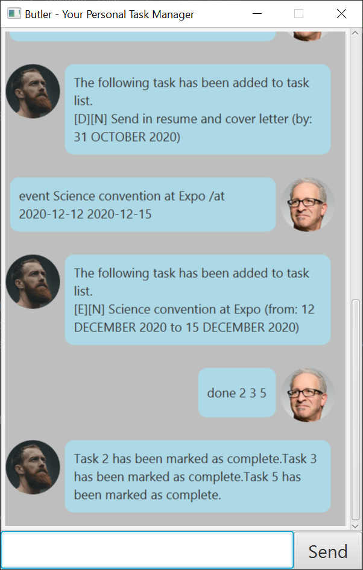

# User Guide

Butler is a **desktop app for managing tasks, optimized for use via a Command Line Interface** (CLI) while still having the benefits of a Graphical User Interface (GUI). If you can type fast, Butler can manage your tasks faster than traditional GUI apps.
This user guide format heavily references https://se-education.org/addressbook-level3/UserGuide.html.

* Table of Contents
{:toc}

--------------------------------------------------------------------------------------------------------------------

## Quick start

1. Ensure you have Java `11` or above installed in your Computer.

1. Download the latest `butler.jar` from [here](https://github.com/hopinxian/ip/releases).

1. Copy the file to the folder you want to use as the _home folder_ for Butler.

1. Double-click the file to start the app. The GUI similar to the below should appear in a few seconds. Note that the app contains some sample data. 
   

1. Type the command in the command box at the bottom of the screen and press Enter to execute it. e.g. typing **`list`** and pressing Enter will show you the current list of tasks. 
   Some example commands you can try:

   * **`list`** : Lists all tasks.

   * **`deadline`**`submit math assignment /by 2020-09-24` : Adds a deadline task to `submit math assignment` by `24 September 2020` to the task list.

   * **`delete`**`3` : Deletes the 3rd task shown in the current list.

   * **`undo`**`1` : Undo the most recent change to the task list.

   * **`bye`** : Exits the app.

1. Refer to the [Features](#features-and-list-of-commands) below for details of each command.

--------------------------------------------------------------------------------------------------------------------

## Features and List of Commands

**Notes about the command format:** 

* Words in `UPPER_CASE` are the parameters to be supplied by the user. 
  e.g. in `todo SUMMARY`, `SUMMARY` is a parameter which can be used as `todo Water the gardens`.

* Items with `…` after them can be used multiple times, excluding zero times. 
  e.g. `INDEX…` can be used as `1`, `2 3 4` etc.

--------------------------------------------------------------------------------------------------------------------

### Listing all tasks : `list`

Shows a list of all tasks in the task list.

Format: `list`

* Each task has two tags in front of the summary of the task. The tags `[T]`, `[D]`, `[E]` means that the task is a todo task, deadline task and event task respectively. The tags `[N]`, `[Y]` means that the task is incomplete and complete respectively. 
* The reply from Butler will also include the number of tasks in the task list.
* A sample output is shown here. 

--------------------------------------------------------------------------------------------------------------------

### Adding a todo task: `todo`

Adds a todo task to the task list. 

Format: `todo SUMMARY`

Examples:
* `todo Water the garden`
* `todo Walk the dog`
* 

--------------------------------------------------------------------------------------------------------------------

### Adding a deadline task: `deadline`

Adds a deadline task to the task list. 

* Dates are to be written in YYYY-MM-DD format.

Format: `deadline SUMMARY /by DEADLINE`

Examples:
* `deadline Submit math assignment /by 2020-12-12`
* `deadline Send in resume and cover letter /by 2020-10-31`
* 

--------------------------------------------------------------------------------------------------------------------

### Adding an event task: `event`

Adds an event task to the task list. 

* Dates are to be given in YYYY-MM-DD format.

Format: `deadline SUMMARY /at STARTDATE ENDDATE`

Examples:
* `event Science convention at Expo /at 2020-12-12 2020-12-15`
* `event Orientation camp at NUS /at 2020-10-31 2020-11-01`
* 

--------------------------------------------------------------------------------------------------------------------

### Completing a task : `done`

Marks the specified task as complete. 

Format: `done INDEX...`

* Marks tasks at the specified `INDEX` as complete.
* The index refers to the index number shown in the displayed task list.
* The index **must be a positive integer** 1, 2, 3,... etc.  
* **Multiple** tasks can be marked as complete in the same command.  e.g. `done 2 3 5` marks tasks 2, 3 and 5 as complete.

Examples:
* `done 1` marks the 1st task as complete.
* `done 2 3 5` mark tasks 2, 3, 5 as complete.
* 

--------------------------------------------------------------------------------------------------------------------

### Deleting a task : `delete`

Deletes the specified task from the task list.

Format: `delete INDEX`

* Deletes the task at the specified `INDEX`.
* The index refers to the index number shown in the displayed task list.
* The index **must be a positive integer** 1, 2, 3,... etc.

Examples:
* `delete 2` deletes the 2nd task in the task list.
* 

--------------------------------------------------------------------------------------------------------------------

### Locating tasks by summary: `find`

Find tasks whose summaries contain the given keyword.

Format: `find KEYWORD`

* The search is case-sensitive. e.g `submit` will not match `Submit`.
* The order of words within the keyword matters. e.g. `math assignment` will not match `assignment math`.
* Only searches the keyword within the summary of each task.
* Only tasks whose summaries contain the keyword completely will be returned. 
  e.g. `submit mathematics` will return `submit mathematics assignment` but not `submit math` nor `submit`

Examples:
* `find assignment`
* `find math assignment`
* 

--------------------------------------------------------------------------------------------------------------------

### Undo a command : `undo`

Undo the specified number of changes to the task list.

Format: `undo UNDO_COUNT`

* Undoes undo count number of changes to the task list.
* Commands that can be undone are `todo`, `deadline`, `event`, `delete`, `done`.
* Undo count **must be a positive integer** 1, 2, 3,... etc.
* If the previous command is `done 1 2`, `undo 1`, undoes changes made to tasks 1 and 2.

Examples: 
* `undo 2` undoes the recent 2 changes to the task list.
* `undo 1` undoes the most recent change to the task list.
* 

--------------------------------------------------------------------------------------------------------------------

### Exiting the program : `bye`

Exits the program. Butler gives a farewell message before closing the program.

Format: `bye`

--------------------------------------------------------------------------------------------------------------------

### Saving the data

Butler saves the list of tasks in the hard disk automatically after every command. There is no need to save manually.

--------------------------------------------------------------------------------------------------------------------

## FAQ

**Q**: How do I transfer my data to another Computer? 
**A**: From the data folder inside the same folder as your program, copy `tasks.txt` and put it into `data/tasks.txt` of the new location.

--------------------------------------------------------------------------------------------------------------------

## Command summary

Action | Format, Examples
--------|------------------
**list** | `list`
**todo** | `todo SUMMARY`   e.g., `todo Water the garden`
**deadline** | `deadline SUMMARY /by DEADLINE`   e.g., `deadline Submit math assignment /by 2020-12-12`
**event** | `deadline SUMMARY /at STARTDATE ENDDATE`  e.g., `event Orientation camp at NUS /at 2020-10-31 2020-11-01`
**done** | `done INDEX...`   e.g., `done 2 4 5`
**delete** | `delete INDEX`   e.g., `delete 3`
**find** | `find KEYWORD`  e.g., `find assignment`
**undo** | `undo UNDO_COUNT`   e.g.,`undo 3`
**bye** | `bye`