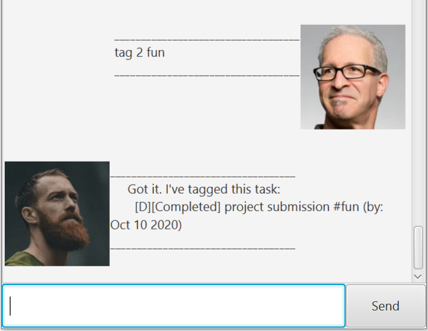

# Duke(Chatty-Bot) User Guide

## Introduction
Duke(Chatty-Bot) is a bot that keeps track of your to do list. It is optimised to be used via a command-line interface (CLI) although a GUI is also provided for clarity. Duke is suitable for those who wish to keep track of their tasks using CLI.

## Features supported by Duke(Chatty-Bot)
Duke(Chatty-Bot) supports a list of features as shown below. 

* Display help message with how to use the bot for first time 
* Add tasks to current task list
  * Type of tasks that can be added are To-Do, Event and Deadline
* Mark a task as done after you have completed them
* Tag a task with any keyword you wish to associate it with
* Find a task by specifying a keyword
* Delete a task from task list
* List all the tasks in current task list
* Close the bot when 'bye' is entered
* Auto updates storage file after each command (if applicable)

Each feature will be described in detail in their respective section.

# Features

## Viewing help message : `help`
Displays a help message containing the list of commands accepted by the bot and a sample command input for each command.

### **Usage**

### `help` - Displays help message

Displays help message with sample command input for each command.

**Example of usage:**

`help`

**Expected outcome:**

## Adding tasks
Add To-Do, Deadline or Event task to task list. All tasks added are marked uncompleted by default. A UI message will be displayed by the bot if the task has been added successfully.

### **Usage**

### `todo TASKNAME` - Adds a To-Do task to the task list

Adds a To-Do task to the task list with the specified task name.

#### **Example of usage:**

`todo read` - Adds a read To-Do task to the task list.

**Expected outcome:**

### `deadline TASKNAME /by YYYY-MM-DD` - Adds a Deadline task to the task list

Adds a Deadline task to the task list with the specified task name and date to be completed by.

#### **Example of usage:**

`deadline project submission /by 2020-10-10` - Adds a project submission deadline to the task list, with event date on 10th October 2020

**Expected outcome:**

### `event TASKNAME /by YYYY-MM-DD` - Adds a Event task to the task list

Adds a Event task to the task list with the specified task name and date the task would be on.

#### **Example of usage:**

`event coding workshop /at 2020-12-20` - Adds a coding workshop event task to the task list, with event date on 20th December 2020.

**Expected outcome:**

## Mark a task as done
Task that has been completed can be marked as done.

### **Usage**

### `done INDEX` - Marks task in task list with specified index as done

Marks task in task list with specified index as done. A UI message will be displayed by the bot if the task has been marked as done successfully. 

#### **Example of usage:**

`done 2` - Marks task with index 2 on the task list as done.

**Expected outcome:**

## Tag a task with a keyword
Tag a task with a keyword specified by user. Each task can only be associated with at most one tag word.

### **Usage**

### `tag INDEX TAGWORD` - Tags the task at specified INDEX with the specified TAGWORD

Tags the task at specified INDEX with the specified TAGWORD. A UI message will be displayed by the bot if the task has been tagged successfully.

#### **Example of usage:**

`tag 2 fun` - Tags second task on the task list as a fun task.

**Expected outcome:**

## Find a task with a keyword
Find a task with a keyword specified by user.

### **Usage**

### `find KEYWORD` - Find the task with the specified KEYWORD

Finds the task with the specified TAGWORD. A UI message will be displayed by the bot with tasks containing the keyword (if any has been found).

#### **Example of usage:**

`find workshop` - Find tasks on the task list containing the word 'workshop'.

**Expected outcome:**

## Delete a task on the task list
Delete a task at a particular index on the task list specified by the user.

### **Usage**

### `delete INDEX` - Delete the task at the specified index

Deletes the task at the specified index in the task list. A UI message will be displayed by the bot if the task at the specified index has been deleted successfully.

#### **Example of usage:**

`delete 3` - Deletes task numbered as number 3 on the task list.

**Expected outcome:**

## List tasks on task list
List out all the tasks on current task list.

### **Usage**

### `list` - list all the tasks

List all the tasks in the task list. A UI message containing all the tasks will be displayed by the bot.

#### **Example of usage:**

`list` - List all the tasks in the task list.

**Expected outcome:**

## Close the bot
Close the bot after user is done with all the necessary actions.

### **Usage**

### `bye` - Closes the bot immediately
Bot will close immediately.

#### **Example of usage:**

`bye` - Bot closes immediately.
