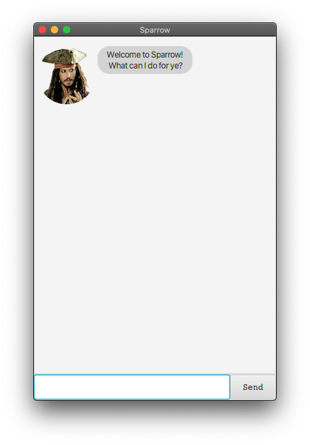

# User Guide

Sparrow is a **desktop app for managing tasks and vocabulary, optimized for use via a Command Line Interface** (CLI) while still having the benefits of a Graphical User Interface (GUI).

- [Quick start](#quick-start)
- [Features](#features)
  * [Viewing help : `help`](#viewing-help)
  * [Adding a task](#adding-a-task)
    + [Adding a Todo : `todo`](#adding-a-todo)
    + [Adding an Event : `event`](#adding-an-event)
    + [Adding a deadline : `deadline`](#adding-a-deadline)
  * [Locating task by name : `find`](#locating-task-by-name)
  * [Marking a task as completed : `done`](#marking-a-task)
  * [Deleting an item : `delete`](#deleting-an-item)
    + [Deleting a task](#deleting-a-task)
    + [Deleting a vocab](#deleting-a-vocab)
  * [Adding a vocab : `vocab`](#adding-a-vocab)
  * [Defining a word : `define`](#defining-a-word)
  * [Listing all tasks/vocab : `list`](#listing)
  * [Exiting the program : `bye`](#exiting-the-program)
  * [Saving the data](#saving-the-data)
- [Command summary](#command-summary)

--------------------

<a name="quick-start"></a>
## Quick start

1. Ensure you have Java `11` or above installed in your computer.
2. Download the latest `Sparrow.jar` from [here](https://github.com/jonfoocy/ip/releases).
3. Copy the file to the folder you want to use as the _home folder_ for Sparrow.
4. Double-click the file to start the app. The GUI similar to the one shown below should appear in a few seconds.



--------------------

<a name="features"></a>
## Features
Notes about the command format:
- Words within `< >` are the parameters to be supplied by the user.
e.g. in `todo <DESCRIPTION>`, `DESCRIPTION` is a parameter to be supplied as `todo buy monkey`

<a name="viewing-help"></a>
### Viewing help : `help`
Shows a message explaining how to access the help page.

Format: `help`

<a name="adding-a-task"></a>
### Adding a task
3 kinds of tasks can be added: Todo, Event, Deadline.

<a name="adding-a-todo"></a>
#### Adding a Todo : `todo`
Adds a todo to the task list.

Format: `todo <DESCRIPTION>`

Example of usage: `todo find crew for ship`

Expected outcome:
```
Aye Aye Captain! I've added this task:
    [T][✘] find crew for ship
```

<a name="adding-an-event"></a>
#### Adding an Event : `event`
Adds an event to the task list. An event must contain the event date.

Format: `event <DESCRIPTION> /at <DATE>`

> Note the `/at` and date format `YYYY-MM-DD`.

Example of usage: <br>
`event Attend Brethren Court meeting /at 2020-10-31`

Expected outcome:
```
Aye Aye Captain! I've added this task:
    [E][✘] Attend Brethren Court meeting (at: 31 Oct 2020)
```

<a name="adding-a-deadline"></a>
#### Adding a deadline : `deadline`
Adds a deadline to the task list. A deadline must contain a due date.

Format: `deadline <DESCRIPTION> /by <DATE>`

> Note the `/by` and date format `YYYY-MM-DD`.

Example of usage: <br>
`deadline Find fountain of youth /by 2020-12-31`

Expected outcome:
```
Aye Aye Captain! I've added this task:
    [D][✘] Find fountain of youth (by: 31 Dec 2020)
```

<a name="locating-task-by-name"></a>
### Locating task by name : `find`
Searches task list for tasks containing the given keyword.

Format: `find <KEYWORD>`

Example of usage: <br>
`find meeting`

Expected outcome:
```
I found tasks matching your search:
1. [E][✘] Attend Brethren Court meeting (at: 31 Oct 2020)
```

<a name="marking-a-task-as-completed"></a>
### Marking a task as completed : `done`
Marks a task as done. Task number corresponds to the latest view of the task list.

Format: `done <TASK NUMBER>`

Example of usage: <br>
`done 1`

Expected outcome:
```
Great job! I've marked this task as completed:
    [E][✓] Attend Brethren Court meeting (at: 31 Oct 2020)
```

<a name="deleting-an-item"></a>
### Deleting an item : `delete`

Deletes a task/word from the respective list. Item number corresponds to the latest view of the category list.

Format: `delete <CATEGORY> <ITEM NUMBER>`

Example of usage: <br>
`delete tasks 2`

Expected outcome:
```
Jolly riddance! I've deleted this task:
    [E][✓] Attend Brethren Court meeting (at: 31 Oct 2020)
```

Example of usage: <br>
`delete vocab 3`

Expected outcome:
```
Jolly riddance! I've deleted this word:
    outlaw
```

<a name="adding-a-vocab"></a>
### Adding a vocab : `vocab`
Adds a word to the vocabulary list. Accompanying definition is optional.

Format: `vocab <WORD> <DEFINITION>`

Example of usage: <br>
`vocab pirate A good guy who sails the seas`

Expected outcome:
```
pirate has been added t' yer vocabulary list.
```

<a name="defining-a-word"></a>
### Defining a word : `define`
Returns definition of a word in the vocab list.

Format: `define <WORD>`

Example of usage: <br>
`define pirate`

Expected outcome:
```
A good guy who sails the seas
```

<a name="listing"></a>
### Listing all tasks/vocab : `list`
Displays all tasks/vocab (depending on argument specified).

Format: `list <CATEGORY>`

Example of usage: <br>
`list tasks`

Expected outcome:
```
Here are the tasks in your list:
1. [T][✘] This is an undone todo
2. [D][✓] This is a completed deadline (by: 18 Sep 2020)
3. [E][✘] This is an event (at: 25 Dec 2020)
```

Example of usage: <br>
`list vocab`

Expected outcome:
```
Here are the words in your list:
1. Pirate
2. Ship
3. Rum
4. Treasure
```

<a name="exiting-the-program"></a>
### Exiting the program : `bye`
Exits the program.

Format: `bye`

<a name="saving-the-data"></a>
### Saving the data
Sparrow data will be saved in the hard disk automatically after any command that changes the data. There is no need to save manually.

--------------------

<a name="command-summary"></a>
## Command summary

Action           | Format, Examples
---------------- | ----------------------------------------------------------------------------------------------
Add todo         | `todo <DESCRIPTION>` <br> e.g., `todo buy ship`
Add event        | `event <DESCRIPTION> /at <DATE>` <br> e.g., `event Appointment with the gallows /at 2003-06-28`
Add deadline     | `deadline <DESCRIPTION> /by <DATE>` <br> e.g., `deadline finalize plan /by 2020-09-30`
Add vocab        | `vocab <WORD> <DEFINITION>` <br> e.g., `vocab buccaneer a pirate`
Done             | `done <TASK NUMBER>` <br> e.g., `done 2`
Delete           | `delete <CATEGORY> <ITEM NUMBER>` <br> e.g., `delete tasks 1`
Find             | `find <KEYWORD>` <br> e.g., `find ship`
List tasks/vocab | `list <CATEGORY>` <br> e.g., `list tasks` or `list vocab`
Help             | help
