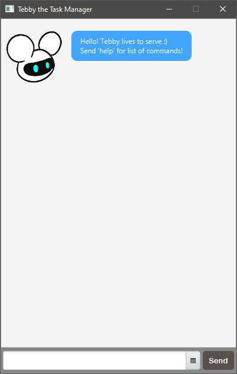

# User Guide

Tebby is a chatbot app for managing tasks via either a Graphical User Interface (GUI) or Command Line Interface (CLI). Both interfaces are
generally the same except GUI has a more user-friendly way of choosing dates from a dropdown calendar when creating tasks. Interacting with
a chatbot with a fun personality can help make task management more appealing, hence improving productivity.

---

## Quick Start
1. Ensure you have Java 11 or above installed in your system. If not, you can get it [here](https://www.oracle.com/java/technologies/javase-jdk11-downloads.html).
2. Download the latest version of `TebbyGUI.jar` from [here](https://github.com/sudogene/ip/releases).
3. Move the file to a directory of your choice, note that additional folder and file will be created in that directory.
4. Double click `TebbyGUI.jar`. You should see a GUI with a welcome message from Tebby.
5. You can start with the `help` command to get a list of commands.



Alternatively, you can start Tebby in CLI mode (for advanced users) with the following steps

2. Download the latest version of `TebbyCLI.jar` from [here](https://github.com/sudogene/ip/releases).
3. Start up your terminal.
5. Navigate to the directory containing `TebbyCLI.jar`.
6. Run the program using `java -jar TebbyCLI.jar`.
7. You should see the following CLI with a welcome message from Tebby.


---

## Features
* Add tasks to a task list
  * Todo
  * Event
  * Deadline
  * Fixed duration task
  
* View task list

* Mark tasks as done

* Delete tasks

* Sort tasks by
  * Description
  * Date time
  * Task type
  
* Find tasks by keyword

---

## Usage
Note that the command keywords are case-insensitive and certain commands have strict formats.
`<field>` describes a required field while `[field]` describes an optional field.
`<[field1] [field2]>` describes a field of at least `field1` or `field2`. Every other text within the
formats should be followed exactly.

---

### `todo` - Adds a Todo task to the list
Format: `todo <description>`

\> Example of usage:

```
todo read a book
```

< Expected outcome:

```
Okay I've added:
  [T][✘] read a book
now you have 1 task in the list!
```

---

### `deadline` - Adds a Deadline task to the list
Format: `deadline <description> /by <date> [time]`

Date format: `YYYY/MM/dd` or `YYYY-MM-dd`

Date alternatives: `today` or `tomorrow` or select from dropdown calendar in GUI

Time format (24 hr): `HH:mm`

\> Example of usage:

```
deadline finish README.md /by tomorrow
```

< Expected outcome:

```
Okay I've added:
  [D][✘] finish README.md (by: 14 Sep)
now you have 2 tasks in the list!
```

---

### `event` - Adds an Event task to the list
Format: `event <description> /at <date> [time]`

Date format: `YYYY/MM/dd` or `YYYY-MM-dd`

Date alternatives: `today` or `tomorrow` or select from dropdown calendar in GUI

Time format (24 hr): `HH:mm`

\> Example of usage:

```
event speed dating /at 2021-03-07 9:00
```

< Expected outcome:

```
Okay I've added:
  [E][✘] speed dating (at: 7 Mar 21, 9:00 am)
now you have 3 tasks in the list!
```

---

### `fixed` - Adds a Fixed Duration Task to the list
Format: `fixed <description> /for <duration>`

Duration format: `<[xh] [ym]>` for x hours y minutes

\> Example of usage:

```
fixed meditate /for 30m
```

< Expected outcome:

```
Okay I've added:
  [F][✘] meditate (for: 30 min)
now you have 4 tasks in the list!
```

---

### `start` - Starts a Fixed Duration Task
Format: `start <task number> <date> <time>`

Alternative: `start <task number> now` to set current date time

Date format: `YYYY/MM/dd` or `YYYY-MM-dd`

Date alternatives: `today` or `tomorrow` or select from dropdown calendar in GUI

Time format (24 hr): `HH:mm`

\> Example of usage:

```
start 4 today 23:00
```

< Expected outcome:

```
Okay I've set this task's start date time:
  [F][✘] meditate (at: 13 Sep, 11:00 pm) (for: 30 min)
```

---

### `done` - Marks Task as done
Format: `done <task number>`

Alternative: `done all`

\> Example of usage:

```
done 4
```

< Expected outcome:

```
Okay I've marked this task as done:
  [F][✓] meditate (at: 13 Sep, 11:00 pm) (for: 30 min)
```

---

### `remove`/`delete` - Removes a Task
Format: `remove <task number>`

Alternative command: `delete`

Alternative: `remove all` to clear the task list

Alternative: `remove done` to remove all tasks that are done

\> Example of usage:

```
remove 4
```

< Expected outcome:

```
Okay I've removed:
  [F][✓] meditate (at: 13 Sep, 11:00 pm) (for: 30 min)
now you have 3 tasks in the list!
```

---

### `sort` - Sorts the list
Format: `sort <sort by>`

Sort by: `name` or `datetime` or `type`

\> Example of usage:

```
sort datetime
```

< Expected outcome:

```
Your list has been sorted!
```

---

### `list` - Views the list
\> Example of usage:

```
list
```

< Expected outcome:

```
Here are the tasks in your list:
1. [D][✘] finish README.md (by: 14 Sep)
2. [E][✘] speed dating (at: 7 Mar 21, 9:00 am)
3. [T][✘] read a book
```

---

### `find` - Filters list by keyword
Format: `find <keyword>`

Tasks with description matching the entire string will be filtered, substrings are not filtered.
For example, `"friend"` will get description `"lunch with friend"` but not `"find girlfriend"`.

\> Example of usage:

```
find book
```

< Expected outcome:

```
Search result:
3. [T][✘] read a book
```

---

## Using the GUI Calendar


The calendar dropdown button can be found on the right next to the text field. Upon selection of a date,
the date will be appended to the text field. This eases user from typing entire dates, and also aids users
in planning of dates with the visuals of a calendar.

---

This is a greenfield Java project using [NUS-CS2103](https://github.com/nus-cs2103-AY2021S1/ip) project template.

---

```
done 1

Okay I've marked this task as done:
    [D][✓] finish README.md (by: 14 Sep)
```
