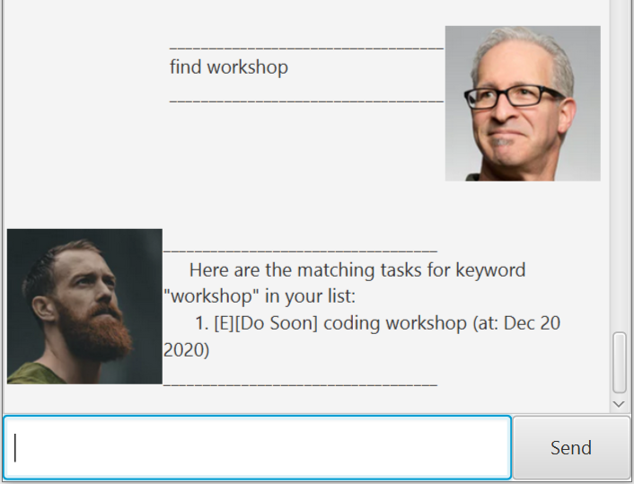

# User Guide
Hello there! This is my user guide for Duke! Please follow the format given in the example, or else errors will be thrown!

## Features summary

Feature | Description | Example
-------------|---------- | --------
list|To view all existing tasks in Duke|list
deadline|Add a new Deadline task to Duke|deadline eat kiwis /by 2020-10-10 18:00
event|Add a new Event task to Duke|event team project /at 2020-10-09 09:00
todo|Add a new To-Do task to Duke|todo read book
done|Complete the task at the given number|done 2
delete|Delete the task at the given number|delete 3
find|Find tasks in Duke that contains the keyword given|find kiwi
exit|Saves current list of tasks and exits Duke|exit

### Feature 1 

<h4>View existing items

To view all the items that you currently have in Duke.

Example of usage: 

    list

Expected outcome:

### Feature 2

<h4>Create a Deadline task

Adds a Deadline task into Duke.

Example of usage: 

If you want to add a deadline task for submitting individual project on 18th September 2020, by midnight:

    deadline individual project /by 2020-09-18 23:59

Expected outcome:

### Feature 3

<h4>Create an Event task

Adds a Event task into Duke.

Example of usage: 

If you want to add an event task for attending a party on 20th September 2020, at 10pm:

    event party at Zouk /at 2020-09-20 22:00

Expected outcome:

### Feature 4

<h4>Create a To-Do task

Adds a To-Do task into Duke.

Example of usage: 

If you want to add a To-Do task for doing your laundry.

    todo laundry

Expected outcome:

### Feature 5

<h4>Complete a Task

Mark a specific task in Duke as complete.

Example of usage: 

If you want to complete your task to do your laundry, which is the 3rd task in Duke:

    done 3

Expected outcome:

### Feature 6

<h4>Remove a Task

Delete and remove a task from Duke.

Example of usage: 

If you want to delete an unfinished task of doing your Individual Project, which is the 1st task in Duke.

    delete 1

Expected outcome:

### Feature 7

<h4>Finding tasks

Type in a keyword into this command to find a certain task that matches what you are looking for.

Example of usage: 

If you want to find tasks about CS2103T:

    find CS2103T

Expected outcome:

### Feature 8

<h4>Exit Duke

To save your current lists of tasks and exit Duke. This will close the Duke GUI.

Example of usage: 

    exit

Expected outcome:

