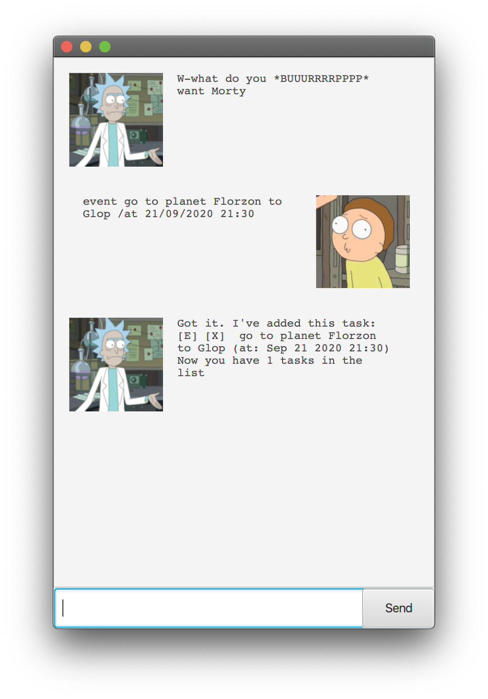
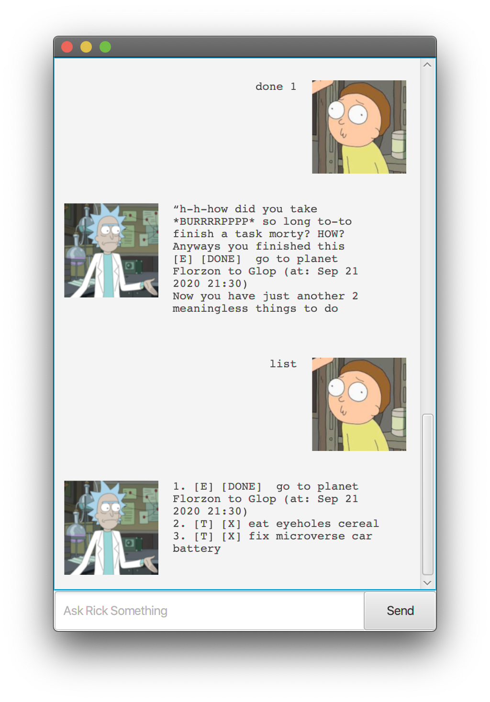

# User Guide
## Features 

### Feature 1: List

To list out all current items in Duke.

Example of usage:

    list

Expected outcome:

### Feature 2: Create Deadlines

Adds a Deadline task into Duke using keywords: deadline...by

Example of usage:

    deadline return book /by 08/10/2020 1800

Expected outcome:
   

### Feature 3: Create Events

Adds an Event task into Duke using keywords: event...at

Example of usage: 

    event birthday /at 08/10/2020 1800

Expected outcome:

Expected outcome:
    
### Feature 4: Create Todos

Adds a Todo task into Duke using keyword: todo

Example of usage: 

    todo read some books

Expected outcome: 

### Feature 5: Completing a Task

Marks a selected task as done

Example of usage: (where 2 is the position)

    done 2

Expected outcome: 

### Feature 6: Removing a Task

Removes a selected task from Duke

Example of usage: (where 1 is the position)

    delete 1

Expected outcome: 

### Feature 7: Finding a Task

Searches for a Task by name

Example of usage: 

    find book

Expected outcome: 

### Feature 8: Ending the programme

Saves and exits Duke

Example of usage: 

    bye

