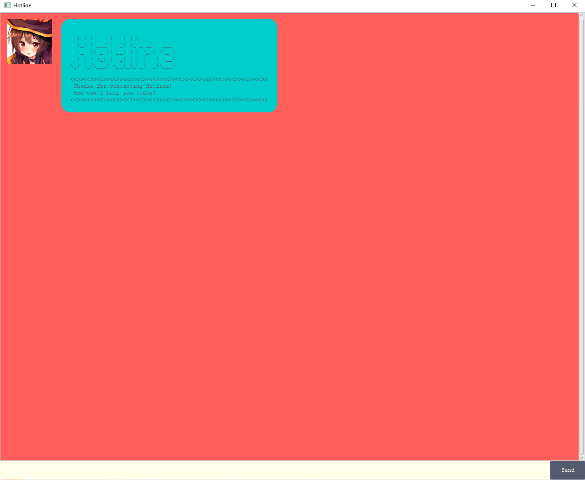
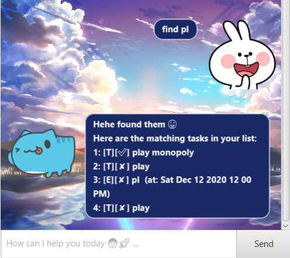

# User Guide

Hotline is a **desktop app for managing personal task list
and it is optimized for use via a Command Line Interface** (CLI) 
while still having a Graphical User Interface (GUI). Hotline can
organize your task list much faster than GUI apps if you can type fast.

* [Quick Start](#quick-start)  
* [Features](#features)  
    * [Add Task](#add-task)
	    * [todo](#todo---create-new-to-do-task)
	    * [deadline](#deadline---create-new-deadline-task)
	    * [event](#event---create-new-event-task)
    * [Delete Task](#delete-task)
    * [List Tasks](#list-tasks)
    * [Update Task](#update-task)
    * [Find Tasks](#find-tasks)
    * [Save Tasks](#save-tasks)
    * [Do Task](#do-task)
    * [Exiting The Program](#exiting-the-program)
* [Command Summary](#command-summary)

## Quick Start
1. Check that you have installed `Java 11` or above in your computer.
2. Download the latest `hotline.jar` from [here](https://github.com/AudreyFelicio/ip/releases).
3. Copy the jar file to the folder you want to use as the root folder of your task management app.
4. Double-click the jar file to start the app. A GUI similar to below will appear in a few seconds.

5. Type the command in text box on the bottom of the GUI and press Enter or click on Send button
to execute the command.
6. Refer to the Features below for the full details of the commands.

## Features 

### Add Task
Adds new tasks to the task list.

Types of task that can be added are:

1. ### `todo` - Create New To-Do Task
    
    Command format:
    
    `todo <string: description>`
    
    Example:
    
    `todo Finish CS2103T Project`
    
    

2. ### `deadline` - Create New Deadline Task
    
    Command format:
    
    `deadline <string: description> /by <string: yyyy-mm-dd>`
    
    Example:
    
    `deadline CCA Registration /by 2020-09-14`
    
    

3. ### `event` - Create New Event Task
    
    Command format:
    
    `event <string: description> /at <string: yyyy-mm-dd>`
    
    Example:
    
    `event Application Release /at 2020-09-18`
    
    

### Delete Task
Deletes no longer wanted tasks from the task list.

### `delete` - Delete Task From List

Command format:

`delete <integer: task number>`

Example:

`delete 1`

### List Tasks
Lists all tasks inside the task list.

### `list`  - List All Tasks

Command format:

`list`

Example: 

`list`

### Update Task
Updates existing tasks' details.

Types of details that can modified are:
1. description
2. time
3. completion status

### `update` - Change Task Details

Command format:

`update <integer: task number> description <string: new description>`

`update <integer: task number> time <string: yyyy-mm-dd>`

`update <integer: task number> mark <integer: 1 for done or 0 for not done>`

Example:

`update 1 description NUS Angklung CCA Registration`

### Find Tasks
Finds tasks that contain a specific keyword.

### `find` - Find Tasks From List

Command format:

`find <string: keyword>`

Example:

`find Release`

### Save Tasks
Saves the task list to the hard disk.

The data is saved on `[root_directory]/tasks.txt`

The task list is automatically saved every time the user add, update, or delete a task.

### Do Task
Does task and mark as completed.

### `done` - Mark Task As Completed

Command format:

`done <integer: task number>`

Example:

`done 2`

### Exiting The Program
Exits the application.

### `bye` - Exit Application

Command format:

`bye`

Example:

`bye`

## Command Summary

Action | Format, Examples
-------|-----------------
**Add to-do** | `todo <string: description>`   e.g. `todo Finish CS2103T Project`
**Add deadline** | `deadline <string: description> /by <string: yyyy-mm-dd>`   e.g. `deadline CCA Registration /by 2020-09-14`
**Add event** | `event <string: description> /at <string: yyyy-mm-dd>`   e.g. `event Application Release /at 2020-09-18`
**Delete** | `delete <integer: task number>`   e.g. `delete 1`
**List** | `list`
**Update** | `update <integer: task number> description <string: new description>`   `update <integer: task number> time <string: yyyy-mm-dd>`   `update <integer: task number> mark <integer: 1 for done or 0 for not done>`   e.g. `update 1 description NUS Angklung CCA Registration`
**Find** | `find <string: keyword>`   e.g. `find Release`
**Done** | `done <integer: task number>`   e.g. `done 2`
**Bye** | `bye`
