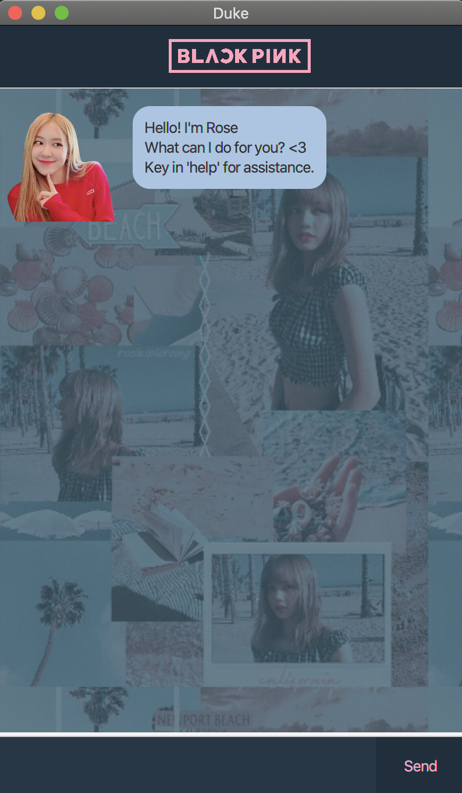

# User Guide

Duke is a **desktop chat bot for managing and storing tasks**. Why try to remember all your tasks when Rose from Blackpink can help track all your tasks for you?

---
## Quick start

1. Ensure you have Java `11` or above installed in your Computer.

1. Download the latest `Duke-0.2-all.jar` from [here](https://github.com/ChenXJ98/ip/releases/tag/v0.1.2).

1. Copy the file to the folder you want to use as the _home folder_ for your Duke.

1. Right-click the file and open the app. The GUI similar to the below should appear in a few seconds.  
   

1. Type the command in the command box and press Enter to execute it. e.g. typing **`help`** and pressing Enter will open the help window. 
      Some example commands you can try:

      * **`list`** : Lists all Tasks.

      * **`todo`**`Call my mom` : Adds a todo task `Call my mom` to the list.
      
      * **`deadline`**`Submit homework`**`/by`** `2020/05/04 0800`: Adds a deadline task `Submit homework` to the list to do by `Monday, 4 May 2020 08:00AM`.
      
      * **`event`**`Blackpink concert`**`/at`** `2020/05/04 0800`: Adds an event task `Blackpink concert` to the list to happen by `Monday, 4 May 2020 08:00AM`.

      * **`done`**`3` : Marks the 3rd Task shown in the list as done.
      
      * **`delete`**`3` : Deletes the 3rd Task shown in the list.
      
      * **`event`**`3 d/BTS concert dt2020/06/04 0900`: Updates the 3rd Task shown in the list with the new description and datetime.

      * **`find`**`apple`: Finds all tasks containing `apple`.      
      
      * **`bye`** : Exits the app.

   1. Refer to the [Features](#features) below for details of each command.

---

## Features 

**:information_source: Notes about the command format:** 

* Words in `UPPER_CASE` are the parameters to be supplied by the user. 
  e.g. in `todo DESCRIPTION`, `DESCRIPTION` is a parameter which can be used as `todo Call my mom`.

* Items in square brackets are optional, but at least one needs to be used. 
  e.g `update INDEX [d/DESCRIPTION] [dt/DATETIME]` can be used as `update 3 d/sleep`, or as `update 3 dt/2020/10/16 1600`, or as `update 3 d/sleep dt/2020/10/16 1600`.

### Viewing help : `help`

Shows a message explaning how to use the app.

Format: `help`

### Listing all tasks : `list`

Shows a list of all tasks currently created and stored.

Format: `list`

### Feature 1 
Description of feature.

## Usage

### `Keyword` - Describe action

Describe action and its outcome.

Example of usage: 

`keyword (optional arguments)`

Expected outcome:

`outcome`
