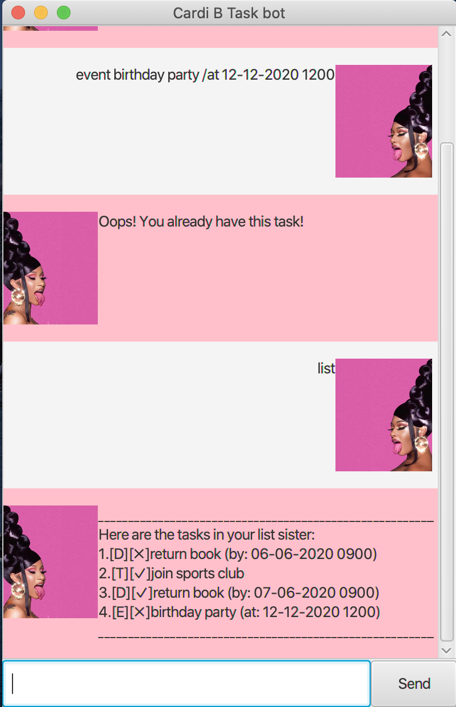

# User Guide



## Features 

### Add, Delete and Update Tasks
User is able to add, delete and update Tasks. 
A Task can be just a generic description, or it can be associated with either a deadline or an event. 

### List and Find Tasks
User is able to find Tasks that matches the given keywords or get a list of all the Tasks in the Task List.

### Mark Tasks as Done
User is able to mark a Task in the Task List as done. 

### Save 
Saves the state of the current Task List into a data file.

## Usage

### `todo DESCRIPTION` - Adds a Todo Task

Adds a Todo Task to the current Task List.

Example of usage: 

`todo buy dinner for family`

Expected outcome:

`Sure! I have added the following todo task to your list: [T][✘] buy dinner for family`

### `deadline DESCRIPTION /by DEADLINE` - Adds a Deadline Task

Adds a Deadline Task to the current Task List.

Example of usage: 

`deadline cs3230 assignment 3 /by 2020-09-19`

Expected outcome:

`Sure! I have added the following deadline task to your list: [D][✘] cs3230 assignment 3 (by: Sep 19 2020)`

### `event DESCRIPTION /at EVENT_TIME` - Adds an Event Task

Adds an Event Task to the current Task List.

Example of usage: 

`event cs2103 project meeting /at 2020-09-12`

Expected outcome:

`Sure! I have added the following event task to your list: [E][✘] cs2103 project meeting (at: Sep 12 2020)`

### `find KEYWORD [MORE_KEYWORDS]` - Finds Tasks based on given keyword(s)
Finds Tasks with descriptions that contains all keywords.

Example of usage: 

`find cs2103 meeting`

Expected outcome:

`1. [E][✘] cs2103 project meeting (at: Sep 12 2020)`

### `list` - List all Tasks in the Task List

Example of usage: 

`list`

Expected outcome:

```
1. [T][✘] buy dinner for family
2. [D][✘] cs3230 assignment 3 (by: Sep 19 2020)
3. [E][✘] cs2103 project meeting (at: Sep 12 2020)
```

### `update ITEM_IDX DESCRIPTION [/by DEADLINE] [/at EVENT_TIME]` - Updates a Task
Updates a Task at **ITEM_IDX** in the Task List.

Example of usage: 

`update 1 buy dinner for family and friends`

Expected outcome:

`Successfully updated task #1: [T][✘] buy dinner for family and friends`

### `delete ITEM_IDX` - Deletes a Task
Deletes a Task at **ITEM_IDX** in the Task List.

Example of usage: 

`delete 1`

Expected outcome:

`OK! I have deleted the following task for your list: [T][✘] buy dinner for family and friends`

### `done ITEM_IDX` - Marks a Task as Done
Marks a Task at **ITEM_IDX** in the Task List as Done / Completed.

Example of usage: 

`done 1`

Expected outcome:

`OK! I have marked the following task as done: [D][✓] cs3230 assignment 3 (by: Sep 19 2020)`

### `save` - Saves Task List
Saves the state of the current Task List into a data file that can be loaded on app start. 

Example of usage: 

`save`

Expected outcome:

`Saved successfully!`

### `bye` - Exit the App
State of the current Task List is saved automatically before exiting the App.

Example of usage: 

`bye`

Expected outcome:

```
Saved successfully!
Bye bye! Hope to see you again soon!
```
