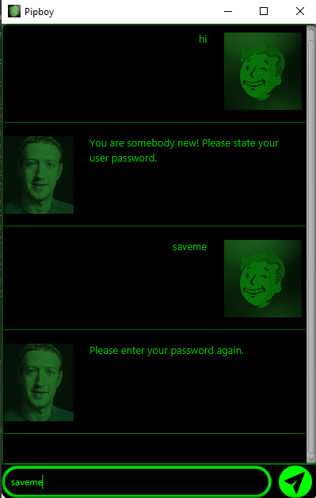
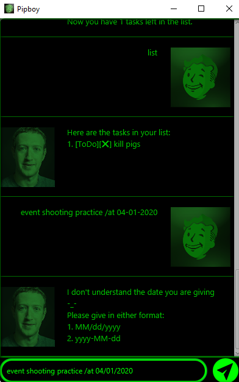
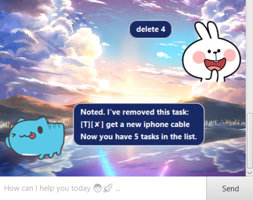

# User Guide for Pipboy

 | 

## Getting Started

1. Download the Jar file from releases.

2. Ensure you have downloaded jdk 11.

3. Run the pipboy.jar file.

## Features 
 
### Saving your user password

Upon startup, if you have never saved a password before(a new user),
Duke will prompt you to enter a password and ask you again to confirm the password.
This will be used for clearing the entire task list.

### Delete entire list - `clear data`

By typing in `clear data`, you have the option to purge the entire tasklist. Before doing so 
you will be prompted for your password. Upon successful authentication, you will trash the entire task
list.

### Saving tasks - `todo | event | deadline`

You can save tasks in the form of todo, event or deadline to your list.
Todo tasks requires no dates as compared to the other two.
Date format is either 2 forms: 
 - `MM/dd/yyyy`
 - `yyyy-mm-dd`

### Done/Deleting task - `done | delete 1 2 3 4 ... n`

 | 

There are options for you to complete/delete either 1 or multiple tasks in a single command.
