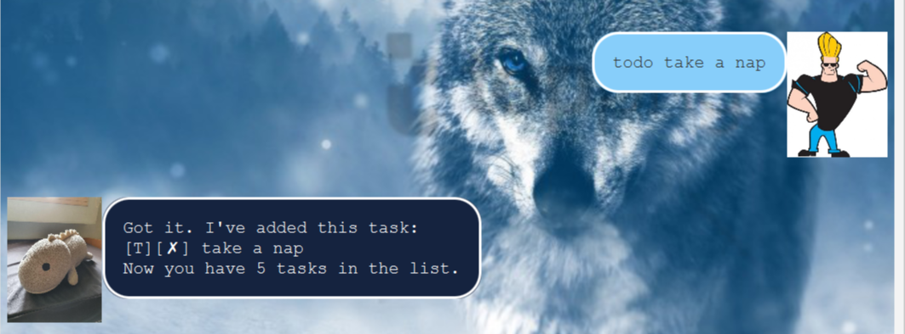

# Mrs Dino User Guide

## Features 

### Add Todo Task

## Usage

### `todo DESCRIPTION` - Adds a new todo task with DESCRIPTION as the task name

Describe action and its outcome.

Example of usage: 

`todo take a nap`

Expected outcome:

