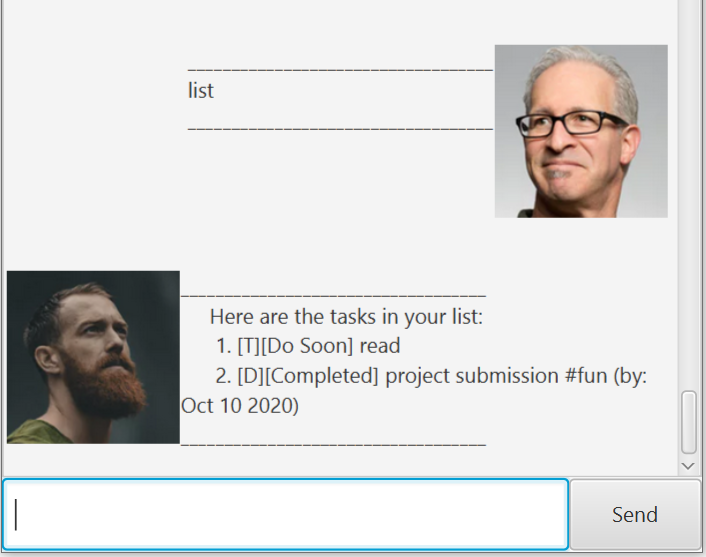
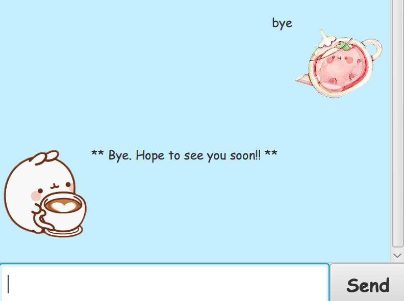

# User Guide

## What is Mug
**Mug** is a Personalise Chatbox helps in **keeping track of our daily tasks**(todo tasks, task with deadline and event). Mug helps you to record your tasks via **Command Line Interface (CLI)** while having the benefits of a Graphical User Interface (GUI).

## QuickStart
1. Ensure you have Java `11` or above installed in your Computer.

1. Download the latest **mug.jar** from here.

1. Copy **mug.jar** to the folder you want to use as the home folder for your Mug.

1. Double-click the file to start the app. The GUI similar to the below should appear in a few seconds. 
   

1. Type the command in the command box and press Enter to execute it. e.g. typing `list` and pressing Enter will list out all saved tasks.

1. Refer to the Features below for details of each command.

## Features 

### `todo`
Adds todo task to your tasks

## Usage

### `todo {description}` - Adding todo task

Adds todo task

Example of usage: 

`todo read book`

Expected outcome:

 

 

### `deadline`
Adds deadline task

## Usage

### `deadline {description} /by {YYYY-MM-DD}` - Adding deadline task

Adds deadline task into the list.

Example of usage: 

`deadline essay /by 2020-01-01`

Expected outcome:

 

### `event`
Adds event tasks

## Usage

### `event {description} /at {YYYY-MM-DD}` - Adding event task

Adds event task into the list.

Example of usage: 

`event conference /at 2019-12-30`

Expected outcome:

 

 

### `delete`
Delete the task

## Usage

### `delete {index}` - Deleteing task

Delete the task with the given index

Example of usage: 

`delete 1`

Expected outcome:

 

 

### `done`
Marks the task done

## Usage

### `done {index}` - Marking task done

Marks the task for the given index done

Example of usage: 

`done 1`

Expected outcome:

 

 

### `list`
Shows all saved taskd

## Usage

### `list` - Listing all tasks

Lists out all tasks in the list

Example of usage: 

`list`

Expected outcome:

 

 

### `undo`
Undo for command(**todo**, **deadline**, **event**, **delete**, **done**)

## Usage

### `undo` - Undo

undo the previous command

Example of usage: 

`undo`

Expected outcome:

 

 

### `find`
Finds tasks from the list

## Usage

### `find {keyword}` - Searching tasks

List out all the tasks contain the keyword given.

Example of usage: 

`find read`

Expected outcome:

 

 

### `Exit`
Close the application

## Usage

### `bye` - 

Disable user input.

Example of usage: 

`bye`

Expected outcome:

 

## Command Summary
Action|Format
------|--------------
todo| `todo {description}`
deadline| `deadline {description} /by {YYYY-MM-DD}`
event| `event {description} /at {YYYY-MM-DD}`
list| `list`
delete| `delete {index}`
done| `done {index}`
undo| `undo`
find| `find {keyword}`

