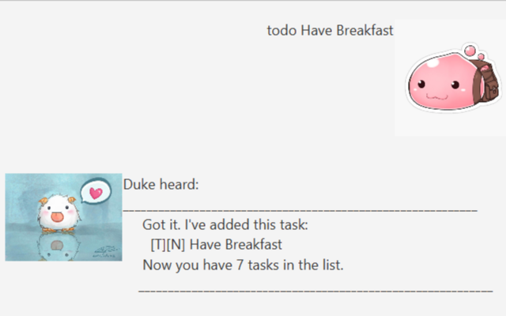
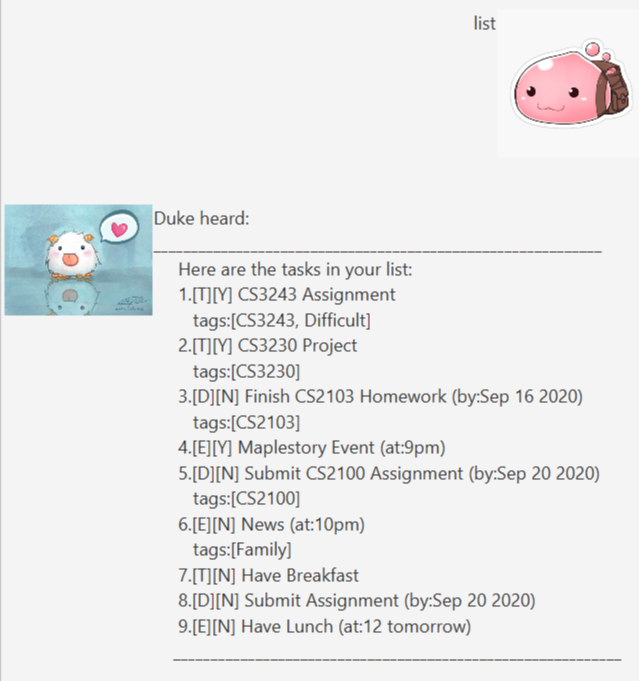

# User Guide


Poring the Chatbot is a Maplestory and Ragnarok inspired Personal Assistant Chatbot. Poring assists you by storing and 
tracking your to-dos, deadlines and events.

This User Guide will show you how to use and maintain Poring the Chatbot to start managing your productive life!

1. **Quick Start**

2. **Task Type**

2. **Features**

    1. Add a todo: `todo`
    
    1. Add a deadline: `deadline`
    
    1. Add a event: `event`
    
    1. List all tasks: `list`
    
    5. Mark a task as done: `done`
    
    6. Delete a task: `delete`
    
    7. Find a task: `find`
    
    8. Tag a task: `tag`
    
    9. Exiting the program: `bye`
    
3. **Command Summary**

## 1. Quick Start
To launch Poring the Chatbot, Simply

- Ensure you have Java 11 or above installed in your computer
- Download the latest .jar file [here](https://github.com/GabrielSimbingyang/ip/releases)
- Open the .jar file on your computer. A duke.txt file will be created to 
- Start typing in your commands in the input box and press Enter

No installation required!


## 2. Task Type
There are 3 types of Task that Poring can process. These include:

```
ToDo
Deadline
Event
```

## 3. Features 

Add a todo: `todo`
    
- A todo task is the simplest task you can ask Poring to take note of!
- It is a task with a short description

Format: `todo DESCRIPTION`

Example: 
* `todo Have Breakfast`
* `todo Nap`

Expected outcome:


    
    
Add a deadline: `deadline`

- A deadline task has both a description as well as a deadline
- The dateline is typed with the format YYYY-MM-DD

Format: `deadline DESCRIPTION /by YYYY-MM-DD`

Example: 
* `deadline Submit Assignment /by 2020-09-20`
* `deadline Watch Lecture /by 2020-10-02`

Expected outcome:


    
    
Add a event: `event`
- A event task has both a description as well as a  time description
- There is no format for the time description

Format: `event DESCRIPTION /at DESCRIPTION`

Example: 
* `event Have Lunch /at 12 tomorrow`
* `event Follow Up With Lecturer /at afternoon-ish`

Expected outcome:


List all tasks: `list`

- Poring will return all the tasks it has recorded so far
- The tasks returned will be in a numbered list 

Format: `list`

Example: 
* `list`

Expected outcome:



Mark a task as done: `done`
- Sets the task in the list as done but does not delete them
- A task status can be seen as either "[Y]" for yes or "[N]' for no

Format: `done INDEX`

Example: 
* `done 6`
* `done 20`

Expected outcome:


Delete a task: `delete`
- Deletes the task regardless of completion status

Format: `delete INDEX`

Example: 
* `delete 1`
* `delete 20`

Expected outcome:


Find a task: `find`
- Searches the recorded tasks using the specified description and returns the details of the found task

Format: `find DESCRIPTION`

Example: 
* `find Lunch`
* `find Happy`

Expected outcome:


Tag a task: `tag`
- Tags the task with a specified description
- The tag can only be one word long

Format: `tag INDEX DESCRIPTION`

Example: 
* `tag 6 Happy`
* `tag 2 Urgent`

Expected outcome:


Exiting the program: `exit`
- Closes the program

Format: `exit`

Example: 
* `exit`

## 4. Command Summary 

Action | Format
-------| ------------------
todo | `todo DESCRIPTION`
deadline | `deadline DESCRIPTION /by YYYY-MM-DD`
event | `event DESCRIPTION /at DESCRIPTION`
list | `list`
done | `done INDEX`
delete | `delete INDEX`
find | `find DESCRIPTION`
tag | `tag INDEX DESCRIPTION`
exit | `exit`