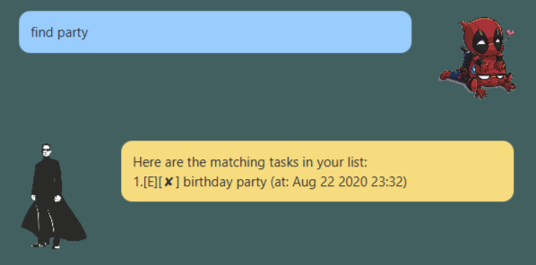
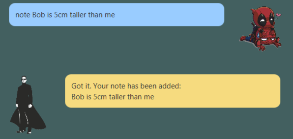

# Dukenizer User Guide
   ```
    ____        _                    
   |  _ \ _   _| | _____  ______ ______ ______  ___  _____
   | | | | | | | |/ / _ \|  __  |__  __|___   |/ _ \|  _  \
   | |_| | |_| |   <  __/| |  | |__||__ /   /_<  __/|     /
   |____/ \__,_|_|\_\___|| |  | |______|______|\___||_|\__\ 
   ```
Dukenizer is a desktop app for __managing your tasks__ and **taking notes** on a Graphical User Interface (GUI). If you 
can type fast, Dukenizer can neatly organize your tasks and notes faster than traditional GUI apps.

* [Quick start](#quick-start)
* [Features](#features)
    * [Command help: `help`](#command-help-help)
    * [Adding a todo: `todo`](#adding-a-todo-todo)
    * [Adding a deadline: `deadline`](#adding-a-deadline-deadline)
    * [Adding an event: `event`](#adding-an-event-event)
    * [Listing all tasks: `list`](#listing-all-tasks-list)
    * [Marking a task as done: `done`](#marking-a-task-as-done-done)
    * [Deleting a task: `delete`](#deleting-a-task-delete)
    * [Find tasks by description: `find`](#find-tasks-by-description-find)
    * [Adding a note: `note`](#adding-a-note-note)
    * [Listing all notes: `notes`](#listing-all-notes-notes)
    * [Removing a note: `RemoveNote`](#removing-a-note-removenote)
    * [Exiting the program: `bye`](#exiting-the-program-bye)
* [Command summary](#command-summary)

##Quick start 
1. Ensure that you have Java 11 installed on your computer

2. Download the latest `duke.jar` from [here]().

3. Copy the file to the folder you want to use as the _home folder_ for your Dukenizer.

4. Double-click the file to start the app, or run `java -jar <folder path>\duke.jar` in your terminal.
The GUI similar to the below should appear in a few seconds.
<br>

5. Type the command in the command box and press Enter to execute it. 
e.g. typing `help` and pressing enter will show you all the available commands
in Dukenizer.

6. Refer to the [Features](#features) below for details of each command.

## Features 
> **Notes about the command format:**
> - Words in `<Arrow brackets>` are the parameters to be supplied by the user.
> e.g. in `todo <description>`, `<description>` is a parameter which can be used as `todo Dukenizer README`.
> - Command is case sensitive.
> - Date and time must be valid and the format must be followed.

### Command help: `help` 

Shows the full list of commands in Dukenizer.

Format: `help`


### Adding a todo: `todo`

Adds a To-do task with the given description to Dukenizer.

Format: `todo <description>`

Examples:
- `todo math assignment`
- `todo buy groceries`

### Adding a deadline: `deadline`

Adds a deadline task with the given description and speciied deadline to Dukenizer.

Format: `deadline <description> /by <yyyy-MM-dd HH:mm>`

Examples:
- `deadline homework /by 2019-12-01 00:11`
<br>

### Adding an event: `event`

Adds an event with the given description and a specified time to Dukenizer.

Format: `event <description> /at <yyyy-MM-dd HH:mm>`

Examples:
- `event birthday party /at 2020-08-22 23:32`
<br>

### Listing all tasks: `list`

Lists the items in your task list.

Format: `list`

### Marking a task as done: `done`

Marks the specified task in your task list as done.

Format: `done <item number>`
- The item number refers to the number shown in the task list.
- The item number is a __positive integer__ starting from 1.

Examples: 
- `list` followed by `done 1` marks the 1st task as done.
 

### Deleting a task: `delete`

Deletes the specified task from your task list.

Format: `delete <item number>`
- The item number refers to the number shown in the task list.
- The item number is a __positive integer__ starting from 1.

Example: `list` followed by `delete 2` deletes the 2nd task 
in your task list.

### Find tasks by description: `find`

Finds tasks whose description contain the given keyword.

Format: `find <description>`
- The search is case-sensitive. e.g. `hi` will not match `Hi`
- Only the description is searched.
- Search term need not be in full words. e.g. `he` will match `hello`

Examples:
- find `party` returns `birthday party`
<br>

### Adding a note: `note`

Adds a note with a given description to Dukenizer.

Format: `note <description>`

Examples:
- `note iron man 2 is nice`
- `note Bob is 5cm taller than me`
<br>

### Listing all notes: `notes`
Lists all the notes in Dukenizer.

Format: `notes`

Examples:
- `note Bob is 5am taller` followed by `notes` lists the
notes in your note list.
<br>

### Removing a note: `RemoveNote`

Removes a note at the specified index.

Format: `RemoveNote <note index>`
- The note index refers to the number shown in the note list.
- The note index is a __positive integer__ starting from 1.

Examples:
- `notes` followed by `RemoveNote 1` removes the first note in the
note list.

### Exiting the program: `bye`

Exits the Program.

Format: `bye`

## Command Summary

Action|Format, Examples
---------------------|----------------------------
Command Help|`help`
Adding a todo| `todo <description>` <br> e.g.,`todo buy groceries`
Adding a deadline|`deadline <description> /by <yyyy-MM-dd HH:mm>` <br> e.g.,`deadline homework /by 2019-12-01 00:11`
Adding an event| `event <description> /at <yyyy-MM-dd HH:mm>` <br> e.g.,`event birthday party /at 2020-08-22 23:32`
Listing all tasks|`list`
Marking a task as done|`done <item number>`<br> e.g., `done 1`
Deleting a task|`delete <item number>`<br> e.g., `delete 3`
Find tasks by description|`find <description>`<br> e.g., `find assignment`
Adding a note|`note <description>` <br> e.g.,`note i am taller than Bob`
Listing all notes|`notes`
Removing a note|`RemoveNote <note index>`<br> e.g., `RemoveNote 1`


