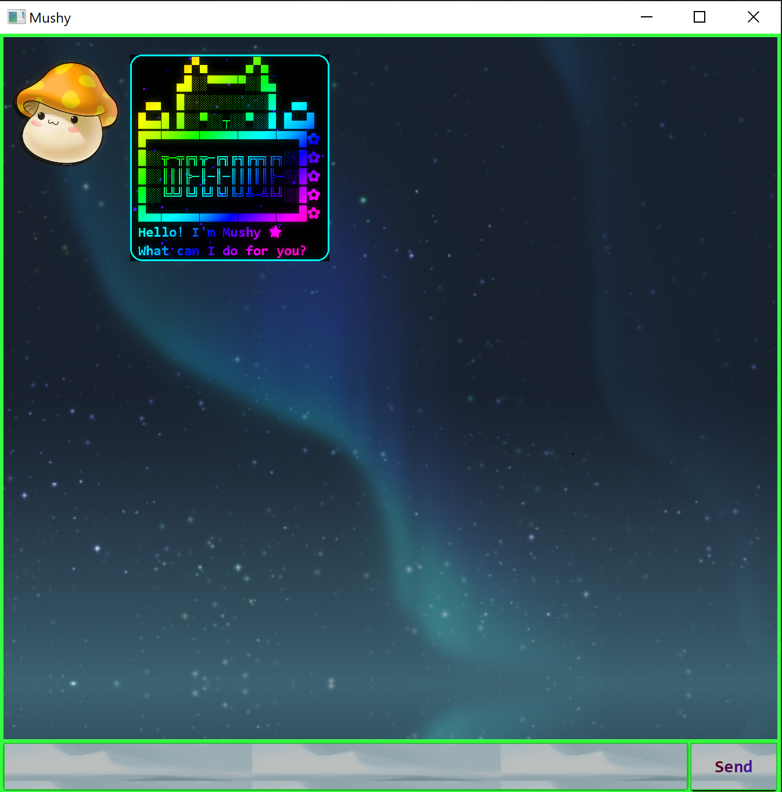
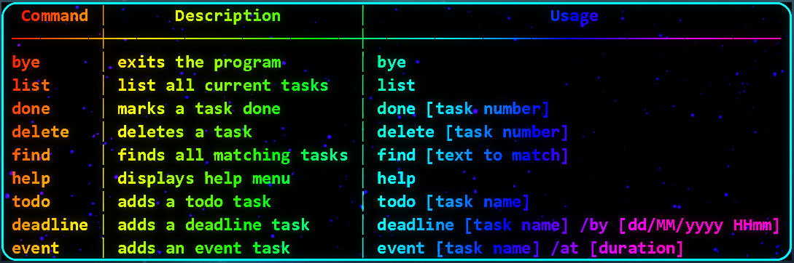

# User Guide
Duke is a CLI-based task manager bot that helps you manage your tasks in a clear and concise manner.
With a just few simple commands to master, organising your tasks will be safe and quick.  
When you run Duke, you should be prompted with the welcome message.

 

### Help
For starters, Duke provides in-program help for valid Duke command calls.  
Command: `help`  

**Note: Any non-Duke commands will render the following response from Duke:**

### Adding tasks
Duke allows 3 types of tasks to be added, and requires the type of task to be specified when 
adding a task.  
Command to add a deadline task: `deadline <description> /by <YYYY-MM-DD> <HH:MM>`  
Command to add an event task: `event <description> /at <YYYY-MM-DD> <HH:MM>`  
Command to add a todo task: `todo <description>`  

Here are some example calls for adding tasks:

### Displaying list of tasks
Duke is able to display all the tasks stored in the local disk, shown in order of addition.  
Command: `list`

### Sorting tasks
Duke is also able to sort these tasks, depending on your choice.  
Command to sort by description: `sortdes`

### Finding tasks
Duke is able to find all matching tasks when given the desired keywords to be found.  
Command: `find <keywords>`

### Marking a task as done
Duke is able to denote tasks as done.  
Command: `done <task number>`

### Deleting tasks
Duke is able to delete tasks that are no longer needed to be tracked.  
Command: `delete <task number>`

### Exiting Duke
Closing Duke can be done either by closing the window, or with a Duke command. Upon the following
response, Duke should be exited within a second.     
Command: `bye`

