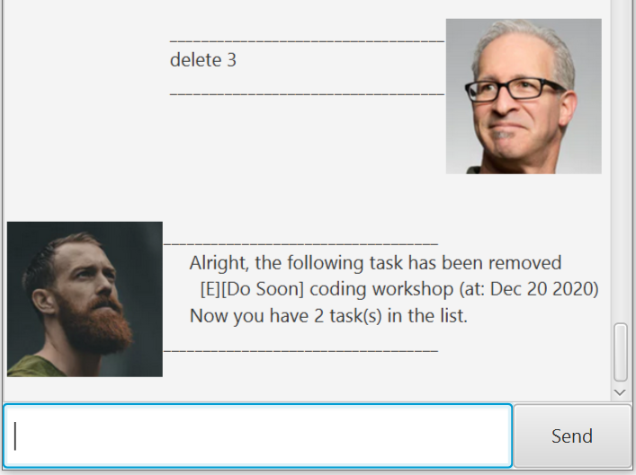

# User Guide

## Introduction
Duke is a Chat-like task manager.

## QuickStart
1. Ensure that [Java 11](https://www.oracle.com/java/technologies/javase-jdk11-downloads.html) or above is installed.
2. Download the [`Duke.jar`](https://github.com/Nauw1010/ip/releases)
3. Double-clicked the jar file.
4. Start chatting with Duke!

## Features 

### Features 1: Add Tasks
Users are able to add tasks of 3 following types:

* Todo: The basic type of task without any other informations.
* Deadline: A kind of tasks that has a deadline.
* Event: A kind of tasks that has a duration to be done.

#### Usage

##### `todo / t` - Add an Todo task

Format:
`todo (your task description)`

Example of usage: 

`todo read book`

Expected outcome:

##### `deadline / dl` - Add an Deadline task

Format:
`deadline (your task description) /by (time)`

Example of usage: 

`deadline return book /by 2020-10-10`

Expected outcome:

##### `event / e` - Add an Event task

Format:
`event (your task description) /at (time)`

Example of usage: 

`event team meeting /at Monday 4-6pm`

Expected outcome:

### Features 2: List tasks
Users are able to list all tasks or using keyword:

* List: List all the tasks in task list.
* Find: List all the tasks containing the keyword.

#### Usage

##### `list / ls` - List all the tasks

Format:
`list`

Expected outcome:

##### `find / f` - Find all the tasks containing the keyword

Format:
`find (keyword)`

Example of usage: 

`find book`

Expected outcome:

### Features 3: Mark done the tasks
Users are able to mark a certain task as done.

#### Usage

##### `done` - Mark done a certain task

Format:
`done (task index)`

Example of usage: 

`done 1`

Expected outcome:

### Features 4: Delete the tasks
Users are able to remove a certain task from task list.

#### Usage

##### `delete / remove / del` - Remove a certain task

Format:
`delete (task index)`

Example of usage: 

`delete 3`

Expected outcome:

