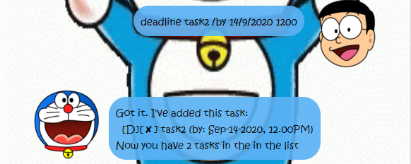
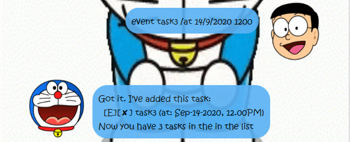
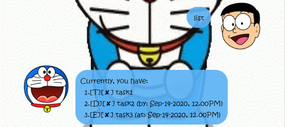

# **Doraemon TaskList - User Guide**

## **Introduction**
This is a greenfield project created for CS2103T - Software Engineering.

Doraemon is a blue cat with no ears. Doraemon has all the tools you need to solve any problems!

We all tend to be forgetful sometimes and if you do not keep track of our tasks properly, you may miss out some activities or deadlines.
Don't worry, Doraemon TaskList is here to help! Doraemon TaskList is a simple application that help you to keep track of your tasks in a list that is stored in your PC.

## Types of Tasks
1. Todos: Tasks without specified date/time.
2. Deadlines: Tasks that are to be done by a certain date and/or time.
3. Events: Tasks that are happening on a certain date and/or time.

## Features 
1. **Adding Tasks**: adds a task into the task list.
    1. **`todo`**: adds a *todo* task to the list.
    2. **`deadline`**: adds a *deadline* task to the list.
    3. **`event`**: adds an *event* task to the list.
2. **Listing Tasks**: shows a list of task(s) from the task list.
    1. **`list`**: shows all the task(s) in the task list.
    1. **`list <date>`**: shows the list of deadline(s)/event(s) on that date.
3. **`done`**: marks the task at a specified index as *done*.
4. **`delete`**: removes a task from the list.
5. **`find`**: search for task(s) that contains the specified keyword(s).
6. **`help`**: shows the list of available commands and their instructions.
7. **`bye`**: exits the application.

## Feature Details

### 1. Adding Tasks
#### 1a. **`todo`** - Adds a *todo* task to the task list.
**Example of Usage:** `todo task1` 

Adds a *todo* task with description task1 to the list. 

This task contains the description with no specified date/time.

**Expected outcome:**

#### 1b. **`deadline`** - Adds a *deadline* task to the task list.
**Example of Usage:** `deadline task2 /by 14/9/2020 1200`

Adds a *deadline* task with description task2 and date 14/9/2020, time 1200.

They are specified in the format `dd/MM/yyyy HHmm`, one space after 
task description. Note that date is necessary while time is optional.
eg. `deadline task2 /by 14/9/2020`

**Expected outcome:**

#### 1c. **`event`** - Adds a *event* task to the task list.
**Example of Usage:** `event task3 /at 14/9/2020 1200`

Adds a *event* task with description task3 and date 14/9/2020, time 1200.

They are specified in the format `dd/MM/yyyy HHmm`, one space after 
task description. Note that date is necessary while time is optional.
eg. `event task3 /by 14/9/2020`

**Expected outcome:**

### 2. List
#### 2a. **`list`** - List all task(s) in the task list. 
**Example of Usage:** `list`

**Expected outcome:**

#### 2b. **`list <date>`** - List all task(s) falling on that date.
**Example of Usage:** `list 14/9/2020`

**Expected outcome:**

### 3. **`done`** - Mark a task as completed.
**Example of Usage:** `done 1`

Marks the task of *index 1* from the task list as completed. The list shows a tick instead of cross.

**Expected outcome:**

### 4. **`delete`** - Removes a task from the task list.
**Example of Usage:** `delete 1`

Removes the task of *index 1* from the task list.

**Expected outcome:**

### 5. **`find`** - Searches for all the task(s) that contains the keyword(s).
**Example of Usage:** `find task`

Finds all the task that contains the word *task* from the task list.

**Expected outcome:**

### 6. **`help`** - Shows the list of available commands and their instructions.
**Example of Usage:** `help`

**Expected outcome:**

### 7. **`bye`** - Use when you want to exit the application.
**Example of Usage:** `bye`

**Expected outcome:** A bye message appears and application closes after 1.5 seconds.

