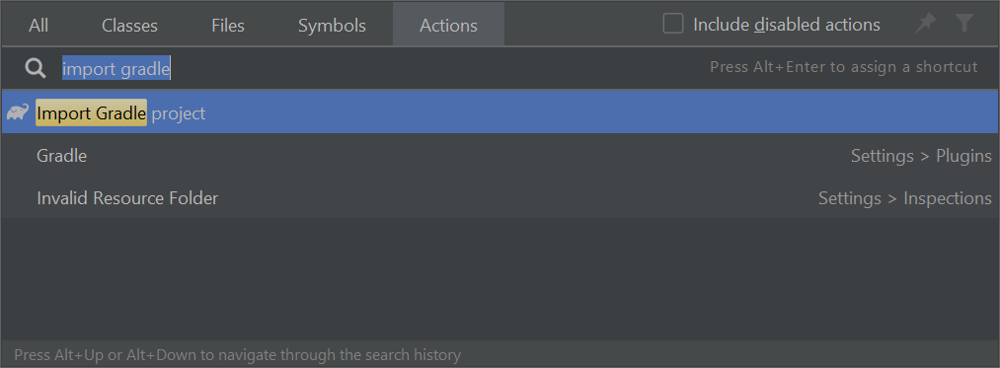

# Gradle Tutorial

Gradle is a _build automation tool_ used to automate build processes. There are many ways of integrating Gradle into a project. In this guide, we will be using the _Gradle wrapper_.

* [Introduction](#introduction)
* [Adding Gradle Support to Your Project](#adding-gradle-support-to-your-project)
* [Adding Plugins](#adding-plugins)
  * [CheckStyle](#checkstyle)
  * [Shadow](#shadow)
* [Adding Dependencies](#adding-dependencies)
  * [JUnit](#junit)
* [Further Reading](#further-reading)

## Introduction

As a developer, you write a _build file_ that describes the project. A build file mainly consists of _plugins_, _tasks_ and _properties_. 

* **Plugins** extend the functionality of Gradle. For example, the `java` plugin adds support for `Java` projects.

* **Tasks** are reusable blocks of logic.  For example, the task `clean` simply deletes the project build directory. Tasks can be composed of other tasks or be dependent on another task. 

* **Properties** change the behavior of tasks. For instance, `mainClassName` of the `application` plugin is a compulsory property which tells Gradle which class is the entrypoint to your application.
  As Gradle favors [_convention over configuration_](https://en.wikipedia.org/wiki/Convention_over_configuration), there is not much to you need to configure if you follow the recommended directory structure.

## Adding Gradle Support to Your Project 

1. Pull the branch named `gradle`. Merge it to the `master` branch. This will add the Gradle wrapper to your project.
   ```
   git checkout --track origin/gradle
   git checkout master
   git merge gradle
   ```
1. Open the `build.gradle` file in an editor. Update the following code block to point to the main class (i.e., the one containing the `main` method) of your application. The code below assumes your main class is `seedu.duke.Duke`
   ```groovy
   application {
       mainClassName = "seedu.duke.Duke"
   }
   ```
1. To check if Gradle has been added to the project correctly, open a terminal window, navigate to the root directory of your project and run the command `gradlew run`. This should result in Gradle running the main method of your project.

:bulb: Simply run the command `gradlew {taskName}` in the terminal and Gradle will run the task! Here are some example commands:
* `gradlew tasks` (or `gradlew tasks --all`): shows a list of tasks available
* `gradlew run`: runs the main class of your project

:bulb: Some plugins may add more helpful tasks so be sure to check their documentation!

#### Using Gradle from within Intellij

1. After adding support for Gradle, Intellij might automatically ask you (via a pop-up at the bottom right corner of the Window) whether to import the project as a Gradle project. In that case, go ahead and say yes.

1. If the above didn't happen, import the Gradle project by `Help > Find Action > Import Gradle Project`.
   

1. If the above didn't work either, close Intellij, delete the Intellij project files (i.e., `.idea` folder and `*.iml` files), and set up the project again, but instead of choosing `Create project from existing sources`, choose `Import project from external model` -> `Gradle`.

After this, IntelliJ IDEA will identify your project as a Gradle project and you will gain access to the `Gradle Toolbar`. Through the toolbar, you run Gradle tasks and view your project's dependencies.

You can click on the Gradle icon in the Gradle toolbar and create a new run configuration for running Gradle tasks without needing to type a `gradlew` command.


## Adding Plugins

Gradle plugins are reusable units of build logic. Most common build tasks are provided as core plugins by Gradle. Given below are instructions on how to use some useful plugins:

### CheckStyle

To add support for _Checkstyle_ (a tool to check if your code complies with a set of style rules), which comes as a core plugin, simply add the line `id 'checkstyle'` into the `plugins` block.

Your build file should look something like this now:
```groovy
plugins {
    id 'java'
    id 'application'
    id 'checkstyle'
}

checkstyle {
    toolVersion = '8.1'
}
// ...
```

Checkstyle expects configuration files for checkstyle to be in `./config/checkstyle/` by convention.
For example, you can copy [these files from se-edu/addressbook-level3](https://github.com/se-edu/addressbook-level3/blob/master/config/checkstyle/) to your project.

The plugin adds a few _tasks_ to your project. Run `gradlew checkstyleMain checkstyleTest` to verify that you have set up Checkstyle properly (the command will check your main code and test code against the style rules).

**Resources**:
* [Gradle documentation for CheckStyle plugin](https://docs.gradle.org/current/userguide/checkstyle_plugin.html)

### Shadow

Shadow is a plugin that packages an application into an executable jar file. To use it, first add the following line to your Gradle build file:
```groovy
plugins {
    //...
    id 'com.github.johnrengelman.shadow' version '5.1.0'
    //...
}
```

The plugin can be configured by setting some properties. Let's try to produce a jar file with the name in format of `{baseName}-{version}.jar`.

Add the following block to your build file:
```groovy
shadowJar {
    archiveBaseName = "duke"
    archiveVersion = "0.1.3"
    archiveClassifier = null
    archiveAppendix = null
}
```

Now you can run the command `gradlew shadowJar`.It publishes an executable jar to `./build/libs/`. You should be able to able to execute the created jar file by double-clicking it or using the command `java -jar {jarName}`?

**Resources**:
* [Gradle documentation for Shadow plugin](https://plugins.gradle.org/plugin/com.github.johnrengelman.shadow)
* [Gradle documentation for JUnit](https://docs.gradle.org/current/userguide/java_testing.html#using_junit5)
* [More about the Shadow plugin](https://imperceptiblethoughts.com/shadow/introduction/)

## Adding Dependencies

Gradle can automate the management of dependencies to third-party libraries. Given below are some examples.

### JUnit

JUnit is a testing framework for Java. It allows developers to write tests and run them. To manage JUnit dependency via Gradle, add the following to your build file:

```groovy
dependencies {
    testImplementation 'org.junit.jupiter:junit-jupiter:5.5.0'
}
```

Then, configure Gradle to use JUnit by adding the following block to your build file:

```groovy
test {
    useJUnitPlatform()
}
```
By convention, java tests belong in `src/test/java` folder. Create a new `test/java` folder in under `src`.
```
src
├─main
│  └─java
│     └─seedu/duke/Duke.java
└─test
    └─java
        └─seedu/duke/DukeTest.java
```

If you have imported your Gradle project into IntelliJ IDEA, you will notice that IDEA is able to mark the test directory as the _Test root_ (colored in green by default) automatically.

You can now write a test (e.g., `test/java/seedu/duke/DukeTest.java`) and run it with `gradlew test`.

**Resources**:
* [Gradle documentation for JUnit](https://docs.gradle.org/current/userguide/java_testing.html#using_junit5)

## Further Reading

Now that you have a general idea of how to accomplish basic tasks with Gradle, here's a list of material you can read to further your understanding.
 
* [Official Gradle Documentation](https://docs.gradle.org/current/userguide/userguide.html)

--------------------------------------------------------------------------------
**Authors:**
* Initial Version: Jeffry Lum
