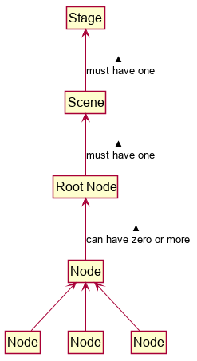

# JavaFX Tutorial 1 – Hello World

# Setting up
Follow the guide in the README.


# Basics of JavaFX: 

## An analogy
In JavaFX, you are a director and each application is a play.
First you provision the props that you will feature in your play. 
These can be hand props for your actors to interact with or even set dressings just to liven up the background.
You then decide where to layout the props for every scene.
With a proper script in hand, you can finally approach a theatre and request for a stage. 
There on, it’s just a matter of pulling the curtains on your masterpiece.

## JavaFX lifecycle of an application
Instead of creating props, you create `Nodes` instead. 
`Nodes` are the fundamental building blocks of a JavaFX application.
You create `Nodes` and place them onto a `Scene`.
A scene can be thought of as a graph, each `Scene` must have a root `Node` and each `Node` can have zero or more children.



Don’t worry too much about this for now, you’ll see exactly how to work with the scene graph in a later tutorial.
Then, you set your `Scene` on a `Stage` provided by JavaFX.
When you call `Stage#show()` method, JavaFX renders a window with your `Stage` on it.

# Writing your first program
As customary, let’s start off with a simple “Hello World” program.
Create a new `HelloWorld.java` class in the `duke.seedu` package.
Have the class extend `javafx.application.Application`. 
This requires you to override the `Application#start()` method and provide a concrete implementation.
Notice that the method signature for `Application#start()` has a parameter `Stage`. 
This is the _primary stage_ that JavaFX provides.

```java
public class HelloWorld extends Application {

    public static void main(String[] args) {
        launch();
    }

    @Override
    public void start(Stage stage) {
        // Our code goes here
    }
}
```

Let’s create a `Label` to contain the text that we want to show.
We then create the `Scene` and set its content.
Finally, we can set the stage and show it. 

```java
public class HelloWorld extends Application {

    public static void main(String[] args) {
        launch();
    }

    @Override
    public void start(Stage stage) {
        Label helloWorld = new Label("Hello World!"); // Creating a new Label control
        Scene scene = new Scene(helloWorld); // Setting the scene to be our Label

        stage.setScene(scene); // Setting the stage to show our screen
        stage.show(); // Render the stage.
    }
}
```

Run the program and you should see something like this:

 

Congratulations! You have created your first GUI application!

# Exercises
1. We mentioned that `Node`s are the fundamental building blocks of JavaFX and used a `Label` as our root node in the HelloWorld application.

    1. What are some of the other types of `Node`s?
    1. How does JavaFX group them?

1. `Node`s can be interacted with like Plain Old Java Objects (POJO).

    1. What properties of a `Label` can you change programmatically?
    1. Try changing the `Label` to have a font of Arial at size 50.

1. You’ve learnt that a `Stage` can be thought of as a window. 
    
    1. Can you have more than one `Stage` an application?
    1. Try creating another stage and showing it! What happens?
    